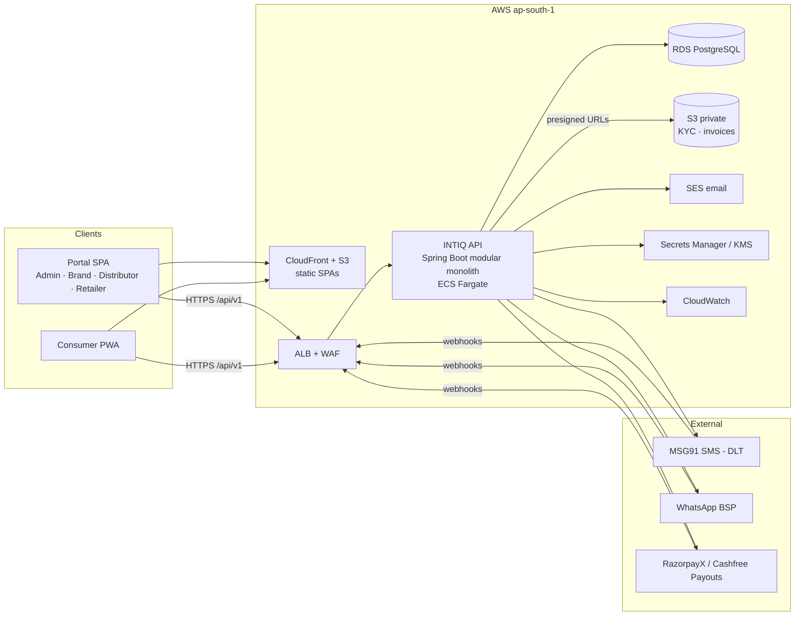
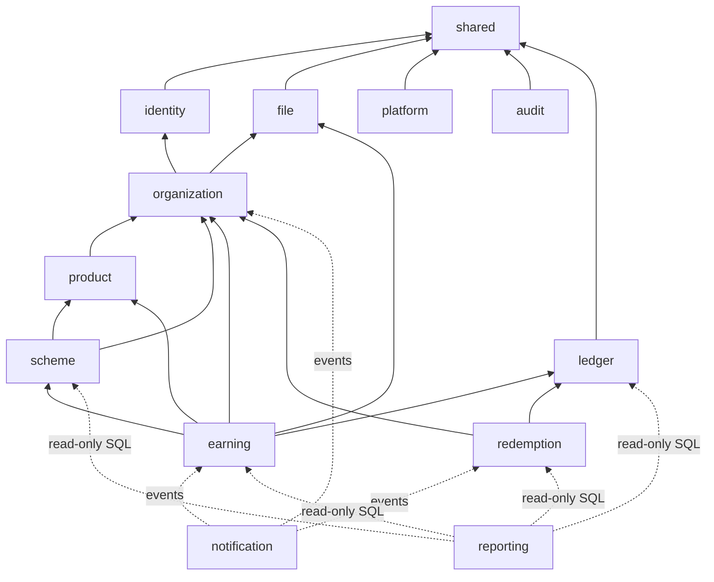
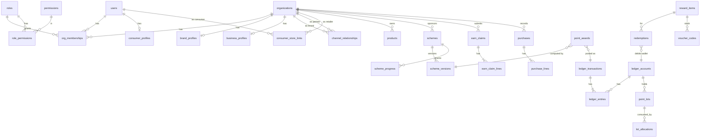
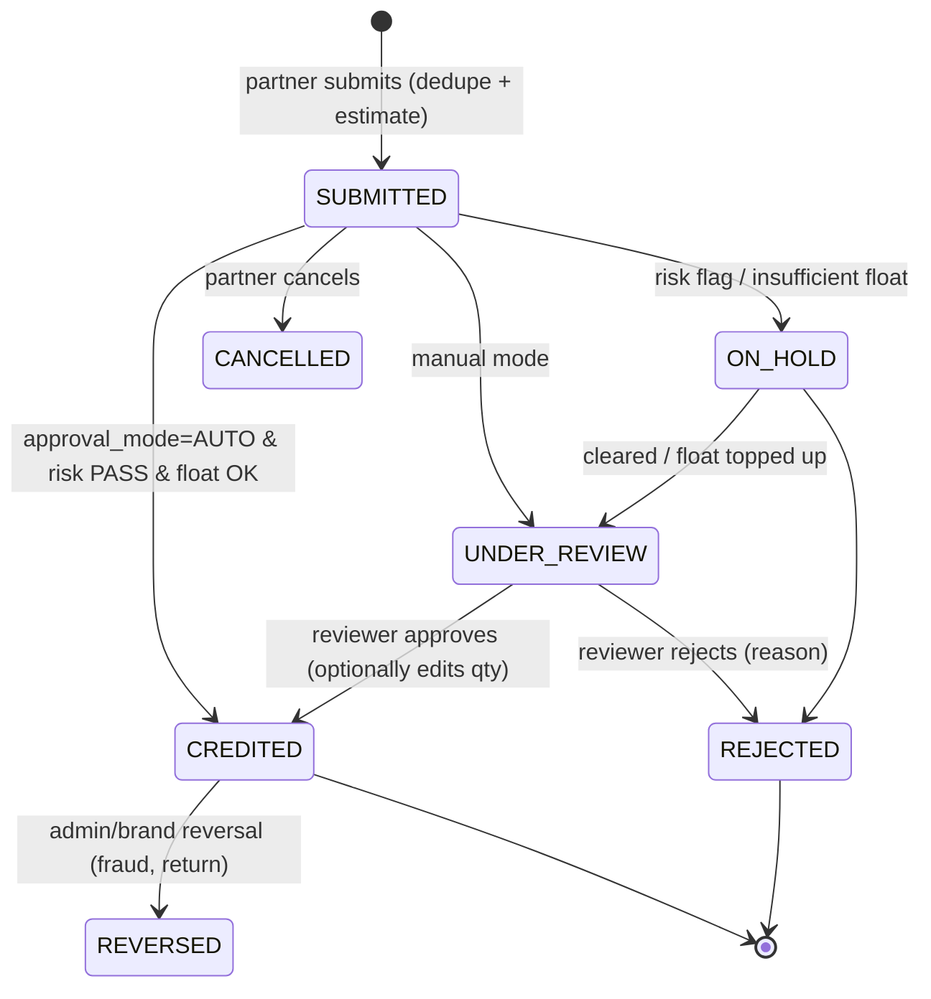
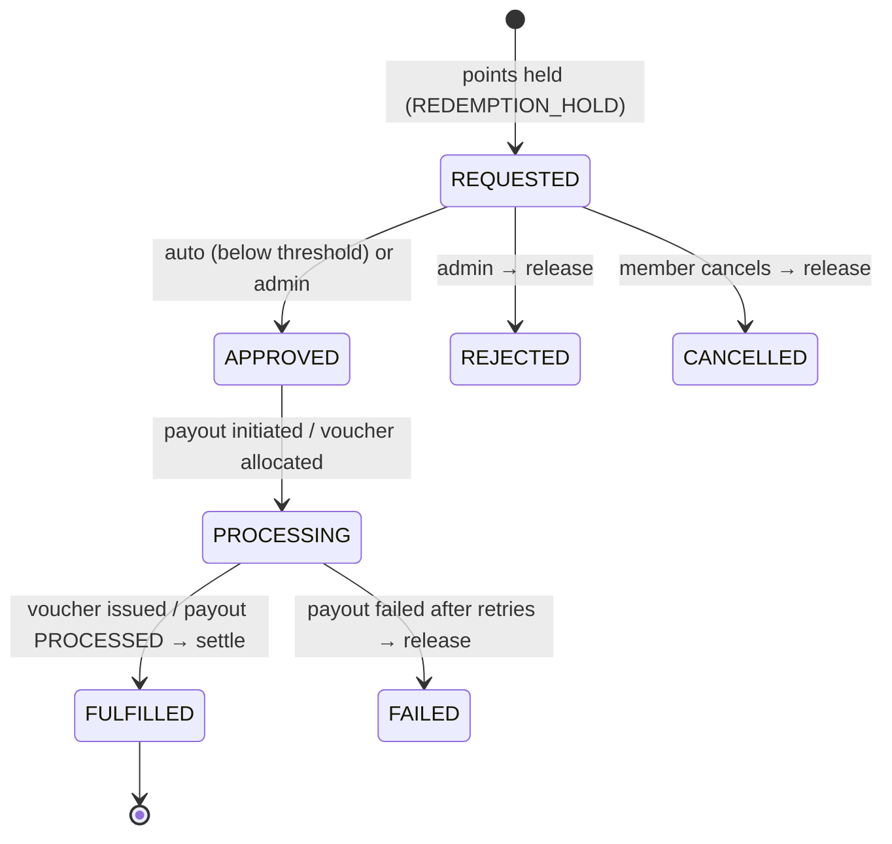
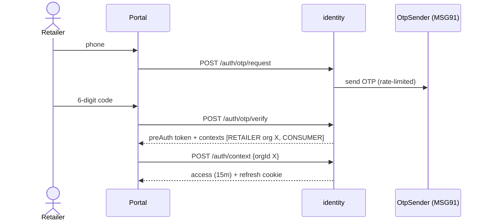
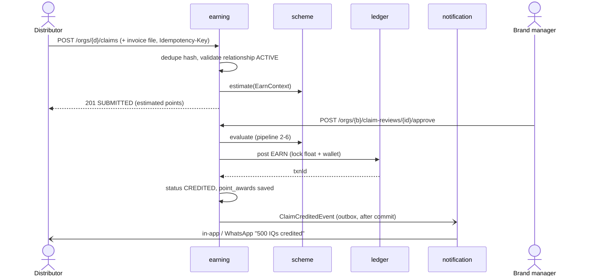
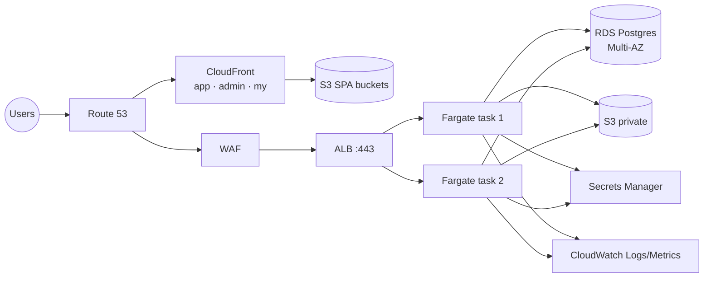

# INTIQ Rewards — Product & Technical Blueprint (HLD)

> **One document to answer:** what are we building, for whom, in which MVP, how is it architected, what does the database look like, which APIs exist (and which are still pending), and why each decision was made.

| Item | Value |
|---|---|
| Product | INTIQ Rewards — B2B + B2C loyalty currency platform for the intimate apparel, comfort & activewear industry |
| Client | Inticede / Peppermint Communications Pvt. Ltd. |
| Build window | 14 Sep 2026 → 12 Nov 2026 (60 days, 4 MVPs) |
| Stack | Java 25 · Spring Boot 4.1 · PostgreSQL 17 · React 19 + TypeScript · AWS ap-south-1 (Mumbai) |
| Doc status | v1.0 — living document. Update §5 (decisions), §15 (API status) and §12 (tables) as work progresses |
| Sources | `INTIQ_Rewards_B2B_Quotation_v2.pdf` (scope & MVPs — **binding**), `INTIQ_Rewards_Complete_Suite_v2` (BRD — vision), `INTIQ-BusinessPlan.docx` (business model) |

**Status legend used throughout:** ⬜ Pending · 🟨 In progress · ✅ Done · ⏸ Deferred / backlog · 🔁 Change request

**Precedence rule:** where documents disagree, the **quotation defines scope**, the **business plan defines currency/commercial rules**, and the **BRD defines intent and future direction**. Conflicts are listed in §5.2.

---

## Table of Contents
1. [Product Overview](#1-product-overview)
2. [Actors, Roles & Portals](#2-actors-roles--portals)
3. [Scope by MVP](#3-scope-by-mvp)
4. [Domain Model & Business Rules](#4-domain-model--business-rules)
5. [Key Decisions, BRD Deviations & Open Questions](#5-key-decisions-brd-deviations--open-questions)
6. [System Architecture](#6-system-architecture)
7. [Design Patterns Catalogue](#7-design-patterns-catalogue)
8. [Technology Stack](#8-technology-stack)
9. [Backend Folder Structure](#9-backend-folder-structure)
10. [Frontend Architecture & Folder Structure](#10-frontend-architecture--folder-structure)
11. [Identity, Security & Role-Based Access](#11-identity-security--role-based-access)
12. [Database Design](#12-database-design)
13. [Core Engines: Scheme Rules, Points Pipeline, Ledger](#13-core-engines-scheme-rules-points-pipeline-ledger)
14. [Workflows & State Machines](#14-workflows--state-machines)
15. [API Architecture & API Catalogue](#15-api-architecture--api-catalogue)
16. [Integrations (Ports & Adapters)](#16-integrations-ports--adapters)
17. [Events, Async Processing & Scheduled Jobs](#17-events-async-processing--scheduled-jobs)
18. [Infrastructure, Deployment & Observability](#18-infrastructure-deployment--observability)
19. [Testing Strategy](#19-testing-strategy)
20. [Engineering Conventions & Definition of Done](#20-engineering-conventions--definition-of-done)
21. [Designing for Change](#21-designing-for-change)
22. [Risks & Mitigations](#22-risks--mitigations)
23. [Appendices](#23-appendices)

---

## 1. Product Overview

### 1.1 What INTIQ is
INTIQ is a **loyalty currency platform** for one industry vertical. There is one currency, **IQ Points ("IQs")**. Brands, distributors and retailers **buy or receive** IQs, **issue** them down the supply chain as rewards, and members **redeem** them for UPI cashback, vouchers or products.

```
Brand ──buys IQs──► Brand Float ──scheme rewards──► Distributor ──► Retailer ──► Consumer
                                                     │                │            │
                                                     └──── redeem ────┴── redeem ──┴──► UPI / Vouchers / Products
```

### 1.2 The three loyalty rails (all rails feed one ledger)
| Rail | Who earns | How they earn | Funded by |
|---|---|---|---|
| **B2B Channel** | Distributors, wholesalers, retailers | Invoice-based purchases (value / units / cartons), slab targets. Later: training, display compliance | Brand (or a distributor for its own sub-schemes) |
| **B2C Brand** | End consumers | Buying the brand's products at an enrolled store, plus actions (signup, referral, birthday) | Brand |
| **B2C Retail** | End consumers | Purchases at an enrolled multi-brand store, plus visits and referrals | Retailer |

### 1.3 Core loop (the scope for MVP 1–3)
`Brand → Scheme → Partner/Consumer → Qualification → IQ Points → Wallet → Redemption`

### 1.4 Commercial rules the system must support
| Rule | Source | System impact |
|---|---|---|
| 1 IQ = ₹1 (BRD said ₹0.50 configurable) | Business plan | `platform_settings.iq_point_value_paise` defaults to 100. The rate is **snapshotted** on every redemption |
| IQ purchase fee of 10% (brand pays ₹11,000 for 10,000 IQs) | Business plan | `float_topups` stores points, base amount, fee and GST separately |
| Redemption service fee of 5% | Business plan | `redemptions.fee_points` / `fee_paise`. Who bears the fee is an open question (§5.3) |
| Brands, distributors and retailers can all buy IQs | Business plan | Any organisation can own an **ORG_FLOAT** account (§13.3) |
| Smart transfer: Brand→Distributor/Retailer/Consumer, Distributor→Retailer, Retailer→Consumer | Business plan | Implemented as **manual awards from float**, which only flow down the hierarchy. There are no peer-to-peer transfers (PPI rule, §5.2) |

---

## 2. Actors, Roles & Portals

| Actor | Organisation type | Login | Portal | Primary jobs |
|---|---|---|---|---|
| **Platform Admin** (INTIQ ops) | `PLATFORM` | Email + password + **TOTP (mandatory)** | Admin portal | Onboard brands, approve partners and KYC, manage the catalogue, confirm float top-ups, fulfil redemptions, audit |
| **Brand** (owner, manager, finance, viewer) | `BRAND` | Email + password (+ optional TOTP) | Portal → Brand area | Manage products, schemes and partners, approve invoice claims, view float and ROI |
| **Distributor / Wholesaler** | `DISTRIBUTOR` | Mobile OTP | Portal → Partner area | Wallet, invoice upload, target progress, redemption. Later: sub-schemes |
| **Retailer** (owner, cashier) | `RETAILER` | Mobile OTP | Portal → Store area | B2B wallet and claims, **plus** running its own consumer program (record purchases, QR, consumers) |
| **Consumer** (a.k.a. customer) | none (individual) | Mobile OTP | Consumer PWA | Enrol, view wallet, earn history, browse catalogue, redeem |

**Identity rule:** one **user** (a phone or email identity) can hold several **memberships**. For example, a retailer owner can also be a consumer. The user logs in once, then picks a context: *Store · Consumer*. Details in §11.

---

## 3. Scope by MVP

> A review is held every Saturday. The next MVP starts only after the client signs off the current one. **Anything not listed in an MVP table is a change request (🔁)**, even when the BRD mentions it.

### 3.1 Timeline
| MVP | Window | Saturday reviews | Milestone | Payment on delivery |
|---|---|---|---|---|
| MVP 1 — Foundation & Administration | 14–28 Sep | 19, 26 Sep | Core platform infrastructure ready | ₹20,000 (+₹10,000 advance) |
| MVP 2 — Scheme Engine & Points Wallet | 29 Sep–13 Oct | 3, 10 Oct | Scheme engine and unified wallet live | ₹35,000 |
| MVP 3 — Partner & Consumer Portals + Redemption | 14–31 Oct | 17, 24, 31 Oct | **Soft launch** (earn and redeem end-to-end) | ₹35,000 |
| MVP 4 — WhatsApp, SMS & Payments | 1–12 Nov | 7 Nov | **Full launch** | ₹20,000 |

> **Critical-path vendor tasks for the client (start them now; each has 1–3 weeks of lead time):** SMS DLT registration (entity, headers, templates), WhatsApp Business account plus a BSP and template approvals, a payout account (RazorpayX or Cashfree Payouts) with business KYC, AWS account, and domains. Without DLT, **production OTP login cannot go live at the MVP 3 soft launch.**

### 3.2 MVP 1 — Platform Foundation & Administration
| # | Feature | Includes | Acceptance (demo-able) |
|---|---|---|---|
| 1.1 | Authentication | Mobile OTP for partners and consumers. Email, password and TOTP for admin and brand. Refresh-token rotation, logout, context switch | Each of the 5 role types can log in and receives a correctly scoped token |
| 1.2 | RBAC | Roles, permissions, org-scoped access guard, `@PreAuthorize` | A brand user cannot read another brand's data (automated test) |
| 1.3 | Multi-tenant structure | Organisations (Brand, Distributor, Retailer, Platform), memberships, **brand↔partner channel relationships** | A brand can see only the partners linked to it |
| 1.4 | Onboarding | Admin creates a brand and invites its owner. Distributors and retailers self-register (OTP, business details, GST), then admin approves. Consumer self-enrols. Brands invite or bulk-import partners (CSV) | Full sign-up → approval → login flow works |
| 1.5 | Basic KYC and profiles | Business profile (GSTIN, PAN, address), consumer profile, KYC documents on S3, admin KYC review, payout method (UPI/bank, encrypted) | Upload, review, then status becomes VERIFIED |
| 1.6 | Admin dashboard (lean) | Counts by org type and status, pending approvals, recent audit events | Admin sees live counts |
| 1.7 | Core DB architecture | Flyway baseline for all MVP 1 tables. Conventions from §12 in place | `./gradlew flywayInfo` is clean on a fresh DB |
| 1.8 | Audit and logging | `audit_logs` for admin and security actions. Structured JSON logs with request ID | Each approve/suspend action appears in the audit list |
| 1.9 | Cross-cutting | ProblemDetail errors, OpenAPI docs, file upload via presigned S3 URLs, platform settings, CI pipeline, staging deploy | Swagger UI is live on staging |

### 3.3 MVP 2 — Scheme Engine & Points Wallet (B2B + B2C)
| # | Feature | Includes | Acceptance |
|---|---|---|---|
| 2.1 | Brand dashboard and profile | Brand profile/logo, KPIs (float, issued, pending claims, active schemes) | KPIs match ledger totals |
| 2.2 | Product master | Categories and SKUs per brand (CSV import), used to target schemes | 500-SKU CSV imports with a row-level error report |
| 2.3 | Scheme builder | B2B (audience: distributor/retailer) and B2C (audience: consumer). Rule types: **ratio per ₹ value, ratio per unit/carton, period slab, fixed action**. Bonus multiplier windows, budget, per-member cap, validity dates, draft → publish → pause → end, immutable versions, **dry-run simulator** | "Buy 100 units → 500 pts; 200 units → 1,200 pts" simulates and credits correctly |
| 2.4 | IQ Points ledger and wallet | Double-entry ledger, org float accounts, member wallets, point lots (sponsor attribution, expiry date), balance and statement APIs, nightly reconciliation | Σ of all balances = 0, reconciliation job is green |
| 2.5 | Float top-up | Brand requests IQs. Admin confirms the offline payment. Float is credited (online payment comes in MVP 4). Fee and GST are recorded | 10,000 IQ top-up shows ₹11,000 payable and credits 10,000 |
| 2.6 | B2B earning (invoice-based) | Partner submits an invoice claim (header, optional lines, file). Duplicate-invoice detection. Rule evaluation | A claim creates pending points with an explanation of which scheme and rule applied |
| 2.7 | B2C earning (purchase/action-based) | Retailer records a consumer purchase by mobile number (auto-enrols the consumer). Retailer program and brand B2C schemes apply. Action events: signup, referral, profile completion | Retailer records ₹1,000 → consumer gets points from the retailer's float |
| 2.8 | Approval and credit workflow | Review queue for the scheme owner (approve / edit quantities / reject / hold). Auto-approve toggle and threshold. Manual award from float (smart transfer). Reversal of credited points | The approve action posts to the ledger. The reject action posts nothing |

### 3.4 MVP 3 — Partner & Consumer Portals + Redemption
| # | Feature | Includes | Acceptance |
|---|---|---|---|
| 3.1 | Distributor portal | Wallet (total and per brand), claims and invoice upload with status, scheme and target progress bars, redemption | Progress bar matches `scheme_progress` |
| 3.2 | Retailer B2B portal | Same B2B views as the distributor, **plus** a store area: record purchase, consumer list and profile, consumer program config (earn rate, minimum redemption), **store QR code** (enrol/join), float balance | A consumer scans the QR, joins the store, and the purchase earns points |
| 3.3 | Consumer PWA | OTP enrolment, wallet by source, transaction history, catalogue browse/filter, redeem, redemption status, profile and consent, installable PWA | Enrol in under 60 s, redeem a voucher |
| 3.4 | Redemption catalogue (basic) | Categories. Item types: **UPI cashback** and **curated vouchers** (pre-purchased codes uploaded by admin). Minimum redemption threshold | Admin uploads 100 voucher codes and they are allocated one per redemption |
| 3.5 | Redemption workflow and history | Request (points on hold) → admin approve → fulfil (voucher auto-issued, UPI marked paid **manually with UTR** in MVP 3) → or fail/reject (points released) | A failed redemption restores the balance and lots exactly |
| 3.6 | Reports (basic B2B + B2C) | Points summary, transaction ledger, claims, redemptions, scheme performance. Filters and CSV export for brand, partner, retailer and admin | CSV totals equal dashboard totals |
| 3.7 | In-app notifications | Inbox for earn, approve, redeem and status events (channel infrastructure is reused in MVP 4) | A bell count updates when a claim is approved |

### 3.5 MVP 4 — WhatsApp Communication & Payment Integration
| # | Feature | Includes | Acceptance |
|---|---|---|---|
| 4.1 | WhatsApp Business API | Template messages for balance updates, points credited, scheme launch alerts, redemption confirmations. Delivery-status webhook. Admin template registry | A WhatsApp message arrives within 1 minute of the event |
| 4.2 | SMS fallback | DLT-registered OTP and critical alerts. Automatic fallback when WhatsApp fails or the user opted out | Blocking WhatsApp still delivers an SMS |
| 4.3 | UPI payouts | Redemption approval triggers a payout through the provider (RazorpayX/Cashfree). VPA validation. Webhook status → settle or reverse. Retries | An approved ₹500 UPI cashback settles automatically and stores the UTR |
| 4.4 | (Optional, if time allows) Online float purchase | Payment link/order for brand top-ups, webhook-confirmed | ⏸ unless the client prioritises it over 4.1–4.3 |
| 4.5 | E2E testing and launch | E2E regression suite for B2B + B2C, prod hardening (backups, alarms, WAF), runbook, go-live support | Go-live checklist (§18.6) is fully green |

### 3.6 Explicitly out of the quoted scope (⏸ backlog / 🔁 change requests)
The BRD vision is much larger than the quoted budget. The architecture leaves **extension points** for each item below (§21), but none of them is built in MVP 1–4:

| Area | Items |
|---|---|
| Tiers and gamification | B2B tiers (Bronze→Diamond) and B2C tiers (Member→Elite), tier multipliers, badges, leaderboards, spin-to-win, challenges, daily check-in, streaks |
| Advanced B2B | MDF module, distributor sub-scheme **UI** (the engine already supports org-owned schemes), sales-team view, training modules/quiz, display compliance photos, target contests |
| Compliance | TDS engine (194R, PAN annual counter, Form 16A), GSTN live API validation (MVP uses format and checksum validation only), DPDP self-serve export/deletion (MVP captures consent only) |
| Integrations | WhatsApp **inbound commands** (`BAL`, `REDEEM`, `TRANSFER`), voucher aggregator API (Qwikcilver/Xoxoday), ERP/DMS/POS integrations, IVR, missed call |
| Catalogue | Physical merchandise with delivery tracking, travel, fuel cards, recharge, donations, brand product vouchers |
| Analytics | Cohorts, churn prediction, A/B testing, attribution, geo heat maps, ROI calculator, scheduled email reports, trade intelligence, Retail Score™ |
| Platform | Billing and SaaS subscriptions, support tickets, INTIMASIA event module, regional languages (i18n is wired, but only English ships), native apps, white-label, public marketing website, store locator map |

---

## 4. Domain Model & Business Rules

### 4.1 Glossary
| Term | Meaning |
|---|---|
| **Organisation (Org)** | A business tenant: `PLATFORM`, `BRAND`, `DISTRIBUTOR` or `RETAILER`. Consumers are individuals, not orgs |
| **Channel relationship** | A brand↔partner link (with an optional parent distributor for retailers). It defines who can earn from whose schemes |
| **Sponsor** | The org whose float funds the points (brand, distributor or retailer) |
| **Float** | The IQ budget an org has bought or allocated and can give away (`ORG_FLOAT` account) |
| **Wallet** | The earned IQs a member can redeem (`MEMBER_WALLET` account). B2B wallet = org wallet; B2C wallet = consumer wallet |
| **Scheme** | An earning program owned by a sponsor, targeting an audience, with one rule type and immutable versions |
| **Claim** | A B2B earn request backed by an invoice. It must be approved before points are credited |
| **Purchase** | A B2C earn event recorded by a retailer for a consumer |
| **Award** | The computed points for one source × scheme, with an explanation. It links to a ledger transaction |
| **Lot** | A batch of earned points in a wallet, carrying sponsor and expiry. Used for FIFO consumption and attribution |
| **Redemption** | Converting wallet points into a reward item. The points are held until fulfilment |

### 4.2 Business rules (enforced in code — each has a test)
| ID | Rule |
|---|---|
| BR-01 | Points are **whole integers** (`BIGINT`). Rupee amounts are stored in **paise** (`BIGINT`). Multipliers and ratios always **round down**. |
| BR-02 | Points move **only** via `LedgerApi.post()`: a double-entry transaction whose entries sum to zero. There are no direct balance updates. |
| BR-03 | Non-system account balances can never go negative (DB `CHECK` plus a service check under a row lock). |
| BR-04 | Ledger rows are **append-only**. Corrections use a reversal transaction (`reverses_txn_id`). |
| BR-05 | A member can earn from a brand's scheme only through an ACTIVE channel relationship with that brand (B2B), or through purchase lines of that brand's products at an enrolled store (B2C). |
| BR-06 | A scheme version is immutable once published. Every award references the exact `scheme_version_id` used. |
| BR-07 | An award cannot exceed the sponsor's available float. If float is insufficient, the claim goes to `ON_HOLD` with reason `INSUFFICIENT_FLOAT`. |
| BR-08 | A duplicate invoice (same seller GSTIN or seller org + invoice number + invoice date + claimant) is rejected at submission. |
| BR-09 | Points flow **downward only**: Platform → Brand float → Distributor/Retailer/Consumer. Distributor → its retailers. Retailer → its consumers. **No peer or upward transfer, and no consumer→consumer transfer** (PPI safety). |
| BR-10 | Redemption: the amount must be ≥ the minimum threshold (platform default, overridable per sponsor). Points are **held** at request time and **settled or released** at the end. |
| BR-11 | Every wallet debit consumes lots **FIFO by `expires_at`, then `created_at`**. A release restores the exact lots. |
| BR-12 | Expiry (default 12 months rolling, configurable) is a lot attribute from MVP 2. The expiry **job** is ⏸ until the client confirms the policy. |
| BR-13 | The IQ→₹ rate and fee percentages are read from settings **and snapshotted** onto each top-up and redemption. |
| BR-14 | Every money- or points-affecting endpoint requires an `Idempotency-Key`. |
| BR-15 | Admin manual adjustments require a reason and are audit-logged. Adjustments above a threshold need a second admin's approval (maker-checker, ⏸ optional). |

---

## 5. Key Decisions, BRD Deviations & Open Questions

### 5.1 Architecture Decision Records (ADR summary)
| ADR | Decision | Why |
|---|---|---|
| 001 | **Modular monolith** (Spring Modulith). Not microservices | 60-day, 1-team budget. Module boundaries are verified by tests, so any module can be extracted later without a rewrite. The BRD itself says "Modular Monolith (Phase 1)" |
| 002 | **Java 25 + Spring Boot 4.1** instead of the BRD's Node/Go | Existing team skill and codebase. Strong transactions for a financial ledger. Virtual threads give high concurrency without reactive complexity |
| 003 | **PostgreSQL only** (with JSONB for flexible scheme rules). No MongoDB, ClickHouse or Meilisearch in the MVPs | One database means ACID across ledger and workflows, lower cost and simpler ops. JSONB gives the schema flexibility the BRD wanted MongoDB for. `pg_trgm` covers search |
| 004 | **Shared schema with an org-id discriminator**, not schema-per-brand | Distributors, retailers and consumers span **many brands** and need a unified wallet. Schema-per-brand would break that. Isolation is enforced in the application layer (§11.5). Postgres RLS can be added later as defence in depth |
| 005 | **Double-entry ledger plus point lots** | Prevents phantom points and gives exact per-brand liability, FIFO expiry and redemption attribution |
| 006 | **Stateless JWT** (RS256) through the Spring Security OAuth2 Resource Server. Remove `spring-session-jdbc` | Stateless API for SPAs and the PWA. No hand-rolled JWT filter |
| 007 | **Strategy-based rule engine with JSON configs**, not Drools/Easy Rules | New rule types plug in as one class plus one JSON schema. Easy to unit-test and to explain in the "why these points" view |
| 008 | **In-process domain events plus a transactional outbox** (Modulith event publication registry). No SQS/Kafka in the MVPs | Reliable async work (notifications, payouts) without extra infrastructure. Events can be externalised to SQS later with a config change |
| 009 | **REST + OpenAPI** with generated TypeScript clients. No GraphQL or WebSockets in the MVPs | Simpler. Dashboards poll every 30–60 s (TanStack Query). SSE can be added later |
| 010 | **Two front-end apps in one monorepo**: `portal` (admin, brand, distributor, retailer) and `consumer` (PWA) | Different UX (dense dashboards versus mobile-first), with shared UI, API client and auth packages |
| 011 | **Caffeine local cache in MVPs 1–3. Redis (ElastiCache) only when running more than one app instance with shared hot state** | Saves cost. Balances are read from `ledger_accounts.balance` (O(1)) |
| 012 | **ECS Fargate + RDS + S3/CloudFront** in ap-south-1 | Managed, low-ops, meets data residency |

### 5.2 Conflicts found across documents (resolved defaults)
| # | Conflict | Default we build | Needs client confirmation? |
|---|---|---|---|
| C1 | 1 IQ = ₹1 (business plan) vs ₹0.50 (BRD) | Configurable, **default ₹1** | Yes |
| C2 | "Smart Transfer" and `TRANSFER 500 <mobile>` (business plan) vs "wallet-to-wallet transfer disabled" (BRD PPI rule) | Downward awards from **float** only (BR-09). P2P transfers are blocked | Yes, and get a legal opinion on PPI |
| C3 | BRD: separate schema per brand | Shared schema (ADR-004) | No (technical) |
| C4 | BRD stack: Node/Go/Mongo/ClickHouse/Kong | Spring/Postgres (ADR-002/003) | Inform the client |
| C5 | Quotation puts SMS OTP in MVP 4, but login is needed from MVP 1 | OTP provider port with a **console adapter** in dev/staging and the **MSG91 adapter by MVP 3** (soft launch) | Yes (DLT timing) |
| C6 | BRD: separate B2B and B2C wallets per person with a unified view | Org wallet (B2B) and consumer wallet (B2C) are separate accounts. The API returns a combined view when a user has both contexts | No |

### 5.3 Open questions for the client (track answers here)
| # | Question | Blocks | Answer |
|---|---|---|---|
| Q1 | Final IQ value (₹1?) | MVP 3 redemption | ⬜ |
| Q2 | Who pays the 5% redemption fee: the member (deducted) or the sponsor? | MVP 3 | ⬜ |
| Q3 | Is 18% GST applied on the 10% IQ purchase fee? Is GST applied on the whole top-up? (ask the CA) | MVP 2 top-up | ⬜ |
| Q4 | Who approves a retailer's invoice claim: the brand only, or distributor confirmation first? | MVP 2 | ⬜ (default: scheme owner) |
| Q5 | Do retailers buy IQs to fund consumer programs in the pilot, or do brands fund all B2C? | MVP 2 | ⬜ |
| Q6 | Expiry policy (12 months rolling?) and whether to enable it at launch | MVP 3 | ⬜ |
| Q7 | Minimum redemption thresholds (B2B vs B2C) | MVP 3 | ⬜ |
| Q8 | Voucher sourcing for MVP 3: which brands, and who buys the codes? | MVP 3 | ⬜ |
| Q9 | WhatsApp BSP (Gupshup / Meta Cloud API direct / Interakt) and payout provider (RazorpayX / Cashfree) | MVP 4 | ⬜ |
| Q10 | Should tiers be pulled into scope (🔁)? | — | ⬜ |
| Q11 | Who owns the AWS account and pays hosting (~US$100–200/month pilot)? | MVP 1 deploy | ⬜ |

---

## 6. System Architecture

### 6.1 System context


### 6.2 Architectural style
- **Modular monolith:** one deployable, **12 business modules**. Each module owns its tables, has one public API (facade plus events), and keeps everything else internal. `ApplicationModules.verify()` runs in CI and fails the build on illegal dependencies or cycles.
- **Layering inside a module:** pragmatic hexagonal.
  - `web` (controllers and DTOs) → `application` (use cases and transactions) → `domain` (entities, rules, domain services) ← `infrastructure` (JPA repositories, provider adapters).
  - Simple CRUD modules may skip the heavy layering. Core modules (ledger, scheme, earning, redemption) keep it strictly.
- **CQRS-lite:** writes go through aggregates and domain services. Dashboards and reports read through dedicated query services (`JdbcClient`, SQL views, materialised views). They never go through JPA entity graphs.
- **Event-driven between modules:** side effects (notifications, progress updates, audit, payouts) are triggered by domain events persisted in the outbox. They never run inline in the main transaction.

### 6.3 Modules
| Module | Responsibility | Owns tables (prefix) | Depends on | MVP |
|---|---|---|---|---|
| `shared` | Kernel: base entity, IDs, `Points`/`Money` value objects, errors, security context, pagination, idempotency, web config | `idempotency_keys`, `status_history` | — | 1 |
| `identity` | Users, credentials, OTP, tokens, MFA, roles, permissions, memberships | `users`, `user_*`, `otp_*`, `refresh_tokens`, `roles`, `permissions`, `role_permissions`, `org_memberships` | shared | 1 |
| `organization` | Orgs, profiles, KYC, payout methods, channel relationships, invitations, consumer↔store links, QR | `organizations`, `*_profiles`, `addresses`, `kyc_*`, `payout_methods`, `channel_relationships`, `invitations`, `consumer_store_links`, `store_qr_codes` | identity, file | 1 |
| `file` | S3 presigned upload/download, file metadata, virus-scan hook | `files` | shared | 1 |
| `platform` | Settings, feature flags, consents, admin dashboard aggregates | `platform_settings`, `feature_flags`, `consents` | shared | 1 |
| `audit` | Audit trail (listens to events plus `@Audited` aspect) | `audit_logs` | shared | 1 |
| `product` | Brand categories and SKUs | `product_categories`, `products` | organization | 2 |
| `scheme` | Schemes, versions, rule engine, bonus events, progress | `schemes`, `scheme_*`, `bonus_events` | organization, product | 2 |
| `ledger` | Accounts, double-entry postings, lots, float top-ups, balances, reconciliation, expiry | `ledger_*`, `point_lots`, `lot_allocations`, `float_topups` | shared **only** | 2 |
| `earning` | B2B claims, B2C purchases, actions/referrals, award pipeline, approvals, fraud checks | `earn_claims`, `earn_claim_lines`, `purchases`, `purchase_lines`, `point_awards`, `referrals` | scheme, ledger, organization, product, file | 2 |
| `redemption` | Reward catalogue, voucher inventory, redemptions, payouts | `reward_*`, `voucher_codes`, `redemptions`, `payouts` | ledger, organization | 3/4 |
| `notification` | Templates, preferences, in-app inbox, WhatsApp/SMS/email dispatch with fallback | `notification_*` | organization, identity (contact lookup) | 3/4 |
| `reporting` | Dashboards, reports and CSV exports (read side) | materialised views only | read-only SQL across tables | 3 |

> **Hard rules:** (1) No JPA relationships across modules. Reference other modules' data **by ID only**. (2) Another module may call only a module's root-package facade, e.g. `LedgerApi`, `SchemeEngine`. (3) `ledger` depends on nothing else. It is the most stable and most tested module. (4) Only `reporting` may read other modules' tables, and only with read-only SQL.

### 6.4 Module dependency graph


---

## 7. Design Patterns Catalogue

| Pattern | Where | Purpose |
|---|---|---|
| **Modular monolith / bounded contexts** | Whole backend | Isolate change. A new MVP adds modules instead of editing old ones |
| **Facade (module API)** | `LedgerApi`, `SchemeEngine`, `OrgDirectory`, `NotificationApi` | A single, stable entry point per module |
| **Strategy + Registry** | `RuleEvaluator` per rule type. `PayoutProvider`, `MessageChannel`, `OtpSender` per provider | Add rule types and providers without touching existing code (Open/Closed) |
| **Pipeline / Chain of Responsibility** | Points calculation: resolve → evaluate → modifiers → stacking → caps → risk → persist | Ordered, pluggable steps. Tier multipliers slot in later as one step |
| **Ports & Adapters (Hexagonal)** | All external integrations (`SmsPort`, `WhatsAppPort`, `PayoutPort`, `StoragePort`) | Swap vendors (Gupshup ↔ Meta, RazorpayX ↔ Cashfree). Console/fake adapters for dev and tests |
| **State machine (enum-based)** | Claim, redemption, payout, scheme, KYC, org status | Only legal transitions are possible, and each transition is logged in `status_history` |
| **Double-entry ledger + event sourcing-lite** | `ledger` | Immutable financial history. Balances are a cached projection of entries |
| **Transactional Outbox** | Spring Modulith event publication registry | Guaranteed delivery of side effects after commit |
| **Observer / domain events** | `ClaimApproved`, `PointsCredited`, `RedemptionRequested`… | Loose coupling between modules |
| **Idempotency key** | Money-moving POSTs and webhooks | Safe retries from clients and providers |
| **Specification** | List/filter endpoints (claims, transactions, partners) | Composable dynamic filters without query explosion |
| **Value Object** | `Points`, `Money(paise)`, `PhoneNumber`, `Gstin`, `Pan` | Validation and arithmetic in one place, no primitive obsession |
| **Template/versioned config** | `scheme_versions.rule_config` (JSONB + `schemaVersion`) | Change rule shapes safely over time |
| **Optimistic locking** | Mutable aggregates (`@Version`) | Detect concurrent edits on schemes and profiles |
| **Pessimistic row lock** | Ledger postings (`SELECT … FOR UPDATE`, locked in ID order) | Correct concurrent balance changes without deadlocks |
| **CQRS-lite read models** | `reporting`, dashboards | Fast aggregates without polluting the domain model |
| **Feature flags** | `feature_flags` (global or per org) | Ship dark, enable per brand, and roll back without a deploy |

---

## 8. Technology Stack

### 8.1 Backend (Spring Boot 4.1 / Java 25 / Gradle)
Use a Gradle **version catalog** (`gradle/libs.versions.toml`) so every version is managed in one place.

| Concern | Library | Notes |
|---|---|---|
| Web | `spring-boot-starter-webmvc` | Enable **virtual threads**: `spring.threads.virtual.enabled=true` |
| Validation | `spring-boot-starter-validation` | Jakarta Validation on request DTOs (Java `record`s) |
| Persistence | `spring-boot-starter-data-jpa` (Hibernate 7) | Write side. Use `JdbcClient` (included via spring-jdbc) for reports and bulk work. **Remove `spring-boot-starter-data-jdbc`** to avoid two repository styles |
| JSONB | Hibernate native `@JdbcTypeCode(SqlTypes.JSON)` | No extra library needed |
| Migrations | `spring-boot-starter-flyway` + `flyway-database-postgresql` | Already present |
| DB driver | `org.postgresql:postgresql` | Already present |
| Modularity and events | `spring-modulith-starter-core`, `spring-modulith-starter-jpa`, `spring-modulith-events-api`, `spring-modulith-starter-test`, `spring-modulith-actuator` | Boundary verification, outbox, module docs generation |
| Security | `spring-boot-starter-security`, `spring-boot-starter-oauth2-resource-server` | JWT (RS256) signed and verified with Nimbus. **Remove `spring-boot-starter-session-jdbc`** |
| MFA | `dev.samstevens.totp:totp` | TOTP for admin and brand users |
| API docs | `springdoc-openapi-starter-webmvc-ui` 3.x | Already present. The spec feeds FE code generation |
| Mapping | MapStruct (+ `lombok-mapstruct-binding`) | Entity ↔ DTO |
| Boilerplate | Lombok | Entities only (`@Getter`, `@NoArgsConstructor(access=PROTECTED)`). **Never `@Data` on entities.** DTOs are `record`s |
| JSON | Jackson 3 (Boot 4 default, `tools.jackson.*`) | Polymorphic rule configs via `@JsonTypeInfo` |
| HTTP clients | Spring `RestClient` + `@HttpExchange` interfaces | For MSG91, WhatsApp BSP and payout provider |
| Resilience | Spring Framework 7 `@Retryable` / `@ConcurrencyLimit` + Resilience4j circuit breaker | Around external providers |
| Caching | `spring-boot-starter-cache` + Caffeine | Role→permission map, settings, catalogue. Redis later (ADR-011) |
| Rate limiting | Bucket4j (Caffeine backend) | OTP request/verify, login, public endpoints |
| Scheduling lock | ShedLock (`shedlock-provider-jdbc-template`) | Nightly jobs stay safe when running several instances |
| AWS | AWS SDK v2 (`s3`, `ses`, `secretsmanager`, `kms`), or Spring Cloud AWS if its Boot 4 line is GA | Presigned URLs, email, secrets |
| IDs | `com.github.f4b6a3:uuid-creator` (UUIDv7) | Time-ordered PKs, index-friendly |
| Phone / validation | `libphonenumber` | E.164 normalisation (+91) |
| QR | ZXing `core` + `javase` | Store QR PNG/PDF |
| CSV / Excel | Apache Commons CSV, FastExcel | Imports and exports |
| Observability | `spring-boot-starter-actuator`, Micrometer (+ `micrometer-registry-cloudwatch2` or Prometheus), Boot structured logging (`logging.structured.format.console=ecs`) | Health, metrics, JSON logs |
| Testing | JUnit 5, AssertJ, Mockito, `spring-boot-starter-*-test`, **Testcontainers (PostgreSQL)**, WireMock, Instancio, Modulith test, ArchUnit | See §19 |

### 8.2 Frontend
| Concern | Library | Notes |
|---|---|---|
| Language / build | TypeScript 5, **Vite**, React 19 | Both apps |
| Monorepo | pnpm workspaces + Turborepo | Shared packages, cached builds |
| Routing | React Router 7 (data routers) | Role-based route trees, lazy-loaded |
| Server state | **TanStack Query** | Caching, polling dashboards, optimistic updates |
| Client state | Zustand | Auth/session, UI prefs. No Redux needed |
| API client | `openapi-typescript` + `openapi-fetch` (generated from springdoc) | Type-safe calls that break at compile time when the API changes |
| Forms | React Hook Form + Zod | Zod schemas mirror backend validation |
| UI kit | Tailwind CSS v4 + **shadcn/ui** (Radix) + lucide-react icons | Accessible, themeable (per-tenant brand colour via CSS variables) |
| Tables | TanStack Table | Server-side pagination, sorting, filtering |
| Charts | Recharts | Dashboard KPIs |
| Dates / numbers | date-fns, `Intl.NumberFormat('en-IN')` | ₹ and lakh/crore formatting |
| Uploads | react-dropzone → presigned S3 PUT | Invoices, KYC |
| QR | `qrcode.react` (render), `@zxing/browser` or `html5-qrcode` (scan in PWA) | Store QR |
| PWA | `vite-plugin-pwa` (Workbox) | Installable consumer app, offline shell |
| i18n | i18next + react-i18next | English at launch. Hindi and others later |
| Notifications | Sonner (toasts) | — |
| Testing | Vitest, Testing Library, **MSW** (API mocks), Playwright (E2E) | — |
| Quality | ESLint (flat config), Prettier, Husky + lint-staged | — |

### 8.3 AWS services (ap-south-1 Mumbai)
| Service | Use | MVP |
|---|---|---|
| **ECS Fargate** + **ECR** | Run the API container (1 task in the pilot, 2 at launch for HA) | 1 |
| **ALB** + **ACM** | HTTPS termination, health checks | 1 |
| **RDS PostgreSQL 17** | Primary DB (single-AZ in the pilot → **Multi-AZ at launch**), automated backups, 7–14 day PITR | 1 |
| **S3** | `intiq-private` (KYC, invoices, SSE-KMS, presigned only), `intiq-public` (logos, catalogue images), `intiq-web-*` (SPAs) | 1 |
| **CloudFront** | Serve both SPAs and public assets. SPA fallback routing | 1 |
| **Route 53** | DNS: `app.`, `admin.`, `my.` (consumer), `api.` | 1 |
| **Secrets Manager** / SSM Parameter Store | DB credentials, JWT keys, provider API keys | 1 |
| **KMS** | S3 SSE-KMS, RDS encryption, data key for column-level PII encryption | 1 |
| **CloudWatch** Logs, Metrics, Alarms (+ SNS topic for alarm email) | Observability | 1 |
| **SES** | Transactional email (invites, password reset, statements) | 1 |
| **AWS WAF** (managed core rule set + rate rule) | Protect the ALB | 4 |
| **AWS Backup** | Scheduled RDS/S3 backup policy | 4 |
| ElastiCache Redis, SQS, EventBridge, Athena | **Not needed in MVPs.** Evolution path only | ⏸ |

> Cost hygiene: put Fargate tasks in public subnets with locked-down security groups, or use VPC endpoints, to **avoid a NAT Gateway** (~US$35+/month) during the pilot.

### 8.4 Third-party providers (behind ports)
| Need | Default choice | Alternative |
|---|---|---|
| SMS OTP / alerts (DLT) | MSG91 | Gupshup SMS, Kaleyra |
| WhatsApp | Gupshup (BSP) | Meta Cloud API direct, Interakt, Infobip |
| UPI payouts | RazorpayX Payouts | Cashfree Payouts |
| Payments (float top-up) | Razorpay Payment Links | Cashfree PG |
| Vouchers | Manual code inventory (MVP 3) | Qwikcilver/Woohoo, Xoxoday Plum (⏸) |

---

## 9. Backend Folder Structure

Single Gradle project. Modules are **Java packages** verified by Spring Modulith. The root package of each module is its public API. Sub-packages are internal.

```
reward/
├── build.gradle
├── settings.gradle
├── gradle/libs.versions.toml              # all dependency versions
├── docker/
│   └── docker-compose.yml                 # postgres:17, mailpit, (minio/localstack optional)
├── docs/
│   ├── INTIQ_Rewards_HLD.md               # this file
│   ├── adr/                               # one markdown per ADR (0001-modular-monolith.md …)
│   └── api/                               # exported openapi.json per release
└── src/
    ├── main/
    │   ├── java/com/intiq/reward/
    │   │   ├── RewardApplication.java
    │   │   │
    │   │   ├── shared/                                  # kernel (Modulith "shared" module)
    │   │   │   ├── domain/        BaseEntity, AuditableEntity, Points, Money, PhoneNumber, Gstin, Pan, Ids
    │   │   │   ├── error/         DomainException, ErrorCode, NotFoundException, GlobalExceptionHandler (ProblemDetail)
    │   │   │   ├── security/      CurrentUser, AuthContext, OrgAccessGuard, Permission enum, @RequiresPermission
    │   │   │   ├── web/           PageResponse, PageQuery, CursorPage, RequestIdFilter, ApiVersion
    │   │   │   ├── idempotency/   @Idempotent, IdempotencyInterceptor, IdempotencyKeyRepository
    │   │   │   ├── statemachine/  StateMachine<S>, StatusHistory
    │   │   │   ├── crypto/        PiiEncryptor (AES-GCM), Masking
    │   │   │   └── config/        JacksonConfig, CorsConfig, OpenApiConfig, AsyncConfig, ClockConfig
    │   │   │
    │   │   ├── identity/
    │   │   │   ├── IdentityApi.java                     # public facade (e.g. findUser, createShadowConsumer)
    │   │   │   ├── UserRegisteredEvent.java             # public events
    │   │   │   ├── web/           AuthController, MeController, dto/
    │   │   │   ├── application/   AuthService, OtpService, TokenService, MfaService, MembershipService
    │   │   │   ├── domain/        User, UserCredential, OtpChallenge, RefreshToken, Role, Permission, OrgMembership
    │   │   │   ├── infrastructure/
    │   │   │   │   ├── persistence/   *Repository (Spring Data)
    │   │   │   │   ├── security/      SecurityConfig, JwtIssuer, JwtAuthConverter, KeyProvider
    │   │   │   │   └── otp/           OtpSender (port), ConsoleOtpSender, Msg91OtpSender
    │   │   │   └── package-info.java                    # @ApplicationModule(displayName="Identity")
    │   │   │
    │   │   ├── organization/
    │   │   │   ├── OrgDirectory.java                    # facade: getOrg, isActivePartner(brandId, orgId), consumer lookup
    │   │   │   ├── web/           OrgController, KycController, PartnerController, InvitationController, AdminOrgController
    │   │   │   ├── application/   OnboardingService, KycService, ChannelService, InvitationService, PartnerImportService
    │   │   │   ├── domain/        Organization, BrandProfile, BusinessProfile, ConsumerProfile, ChannelRelationship, …
    │   │   │   └── infrastructure/persistence/
    │   │   │
    │   │   ├── file/              FileApi, web/, application/, infrastructure/s3/
    │   │   ├── platform/          SettingsApi, FeatureFlags, web/(AdminSettingsController, AdminDashboardController) …
    │   │   ├── audit/             AuditApi, @Audited aspect, listeners, web/AdminAuditController
    │   │   ├── product/           ProductCatalog (facade), web/, application/, domain/, infrastructure/
    │   │   │
    │   │   ├── scheme/
    │   │   │   ├── SchemeEngine.java                    # facade: resolveApplicable(ctx), evaluate(ctx), simulate(...)
    │   │   │   ├── SchemePublishedEvent.java
    │   │   │   ├── web/           SchemeController, BonusEventController, dto/
    │   │   │   ├── application/   SchemeService, SchemeProgressService, SimulationService
    │   │   │   ├── domain/
    │   │   │   │   ├── Scheme, SchemeVersion, SchemeStatus, BonusEvent, SchemeProgress
    │   │   │   │   └── rules/
    │   │   │   │       ├── RuleConfig.java          # sealed interface, @JsonTypeInfo(property="type")
    │   │   │   │       ├── RatioAmountRule, RatioUnitRule, SlabPeriodRule, ActionFixedRule (records)
    │   │   │   │       ├── RuleEvaluator.java       # strategy interface
    │   │   │   │       ├── evaluators/              # one class per rule type
    │   │   │   │       └── RuleEvaluatorRegistry.java
    │   │   │   └── infrastructure/persistence/
    │   │   │
    │   │   ├── ledger/
    │   │   │   ├── LedgerApi.java                       # post(PostingRequest), balance(), statement(), hold/settle/release
    │   │   │   ├── PostingRequest.java, AccountRef.java, TxnType.java
    │   │   │   ├── PointsCreditedEvent.java, LowFloatEvent.java
    │   │   │   ├── web/           WalletController, FloatController, AdminLedgerController
    │   │   │   ├── application/   PostingService, LotAllocator, FloatTopupService, ReconciliationJob, ExpiryJob
    │   │   │   ├── domain/        LedgerAccount, LedgerTransaction, LedgerEntry, PointLot, LotAllocation, FloatTopup
    │   │   │   └── infrastructure/persistence/
    │   │   │
    │   │   ├── earning/
    │   │   │   ├── ClaimApprovedEvent.java, PurchaseRecordedEvent.java
    │   │   │   ├── web/           ClaimController, ClaimReviewController, PurchaseController, AwardController
    │   │   │   ├── application/
    │   │   │   │   ├── ClaimService, ReviewService, PurchaseService, ManualAwardService, ReferralService
    │   │   │   │   └── pipeline/      EarnContext, AwardPipeline, steps/(Resolve, Evaluate, Modifiers, Stacking, Caps, Risk, Persist)
    │   │   │   ├── domain/        EarnClaim, EarnClaimLine, Purchase, PurchaseLine, PointAward, ClaimStatus, fraud/
    │   │   │   └── infrastructure/persistence/
    │   │   │
    │   │   ├── redemption/
    │   │   │   ├── RedemptionRequestedEvent.java, RedemptionFulfilledEvent.java
    │   │   │   ├── web/           CatalogController, RedemptionController, AdminCatalogController, AdminRedemptionController, PayoutWebhookController
    │   │   │   ├── application/   CatalogService, RedemptionService, FulfillmentService, VoucherService, PayoutService
    │   │   │   ├── domain/        RewardCategory, RewardItem, VoucherCode, Redemption, Payout, statuses
    │   │   │   └── infrastructure/{persistence, payout/(PayoutPort, RazorpayXAdapter, CashfreeAdapter, ManualAdapter)}
    │   │   │
    │   │   ├── notification/
    │   │   │   ├── NotificationApi.java
    │   │   │   ├── web/           InboxController, PreferenceController, AdminTemplateController, ChannelWebhookController
    │   │   │   ├── application/   NotificationListeners (@ApplicationModuleListener), Dispatcher, FallbackPolicy
    │   │   │   ├── domain/        Template, Message, Preference, Channel
    │   │   │   └── infrastructure/channel/(MessageChannel port, WhatsAppGupshupAdapter, Msg91SmsAdapter, SesEmailAdapter, InAppAdapter, ConsoleAdapter)
    │   │   │
    │   │   └── reporting/
    │   │       ├── web/           DashboardController, ReportController, AdminReportController
    │   │       ├── application/   *QueryService (JdbcClient), CsvExporter, MaterializedViewRefresher
    │   │       └── sql/           (named SQL files if preferred)
    │   │
    │   └── resources/
    │       ├── application.yml
    │       ├── application-local.yml | application-staging.yml | application-prod.yml
    │       ├── db/migration/          V2026_09_15_1000__identity_baseline.sql …   (§12.6)
    │       ├── db/seed/               R__seed_roles_permissions.sql, R__seed_settings.sql (repeatable)
    │       ├── templates/             email templates
    │       └── rule-schemas/          JSON Schemas per rule type (used by FE and validation)
    └── test/java/com/intiq/reward/
        ├── ModularityTests.java                 # ApplicationModules.verify() + generate docs
        ├── support/                             # Testcontainers base, fixtures, AuthTestHelper
        ├── ledger/ … scheme/ … earning/ …       # mirrors main
        └── e2e/                                 # API-level end-to-end flows per MVP
```

**Module declaration example**
```java
// scheme/package-info.java
@org.springframework.modulith.ApplicationModule(
    displayName = "Scheme Engine",
    allowedDependencies = { "shared", "organization", "product" })
package com.intiq.reward.scheme;
```

**Mapping from your current skeleton:** `auth/*` → `identity/…`; `common/*` → `shared/…` (rename `constants`/`validators` to `PascalCase` classes or value objects); `audit/*` → `audit/…`. Replace `ApiResponse`/`ErrorResponse` with plain DTOs and `ProblemDetail` (§15.1).

---

## 10. Frontend Architecture & Folder Structure

### 10.1 Apps and hosts
| App | Host | Audience | Notes |
|---|---|---|---|
| `portal` | `app.intiqrewards.in` (`/brand`, `/partner`, `/store`), `admin.intiqrewards.in` (`/admin`) | Admin, brand, distributor, retailer | One build. The role area is chosen from the token's context. Each area is lazy-loaded. Admin can be split into its own build later |
| `consumer` | `my.intiqrewards.in` | Consumers | Mobile-first PWA with bottom tabs: Home, Earn, Redeem, Activity, Profile |

### 10.2 Monorepo layout
```
intiq-web/
├── apps/
│   ├── portal/
│   │   └── src/
│   │       ├── app/              main.tsx, providers (QueryClient, Auth, Theme), router.tsx, error boundaries
│   │       ├── layouts/          AdminLayout, BrandLayout, PartnerLayout, StoreLayout (sidebars from permission-filtered nav config)
│   │       ├── routes/           admin.routes.tsx, brand.routes.tsx, partner.routes.tsx, store.routes.tsx
│   │       ├── features/         ← feature-sliced; each feature = api/ components/ hooks/ pages/ schemas/ types.ts
│   │       │   ├── auth/  onboarding/  kyc/  partners/  products/  schemes/  float/
│   │       │   ├── claims/  reviews/  wallet/  purchases/  consumers/  qr/  redemption/
│   │       │   ├── catalog-admin/  reports/  dashboard/  notifications/  settings/  audit/
│   │       └── lib/              nav config, permission helpers
│   └── consumer/
│       └── src/  app/  routes/  features/(enroll, home, wallet, catalog, redeem, activity, profile, stores)  pwa/
├── packages/
│   ├── api-client/     generated OpenAPI types + openapi-fetch client + TanStack Query hooks per module
│   ├── auth/           token storage (access in memory, refresh via httpOnly cookie*), <RequirePermission>, useCan()
│   ├── ui/             shadcn components, DataTable, StatCard, PointsBadge, StatusChip, EmptyState, theme tokens
│   ├── utils/          formatPoints, formatINR (paise→₹), formatPhone, dates
│   └── config/         eslint, tsconfig, tailwind preset
├── turbo.json · pnpm-workspace.yaml
```
\* **Token storage:** keep the access token in memory. Keep the refresh token in an `httpOnly; Secure; SameSite=Strict` cookie scoped to `/api/v1/auth/token`. This limits XSS exposure.

### 10.3 Frontend rules
1. **Never hand-write API types.** Run `pnpm gen:api` after every backend OpenAPI change and commit the generated types.
2. Route guards check the **permission**, not the role. Menu items are filtered by permission. The backend always enforces access anyway.
3. One `features/<name>` folder per backend capability. It can be moved or removed without touching other features.
4. Money and points are formatted only through `packages/utils`.
5. The design system lives in `packages/ui`. Apps do not add raw Tailwind "one-off" components for common patterns.

---

## 11. Identity, Security & Role-Based Access

### 11.1 Identity model
```
users (phone/email identity)
  ├── user_credentials (password hash, TOTP secret — only for email logins)
  ├── consumer_profiles (0..1)            → consumer context
  └── org_memberships (0..n) → organizations(type) + roles  → org contexts
```
- **Context-scoped tokens:** after login the API returns the available contexts, e.g. `[ {type:CONSUMER}, {type:RETAILER, orgId, role:RETAILER_OWNER} ]`. `POST /auth/context` issues an access token bound to **one** context. Every request is therefore unambiguous about which tenant it acts for.
- **Shadow consumers:** when a retailer records a purchase for an unknown mobile number, the system creates a `users` row (status `UNVERIFIED`) plus a consumer profile. The consumer claims it later by OTP. Their points are already there.

### 11.2 Authentication flows
| Actor | Flow | Token lifetimes |
|---|---|---|
| Consumer, distributor, retailer | `POST /auth/otp/request` → `POST /auth/otp/verify` → contexts → `POST /auth/context` | Access 15 min. Refresh 30 days (consumer 90), rotated on every use |
| Brand | `POST /auth/login` (email + password) → if TOTP is enabled, `POST /auth/mfa/verify` → context | Same |
| Platform admin | Same as brand, but **TOTP is mandatory** (enforced at first login via `/auth/mfa/setup`) | Access 15 min. Refresh 12 h |

**OTP policy:** 6 digits. Stored as an HMAC-SHA256 hash, never in plaintext. Valid for 5 minutes. At most 5 verify attempts, then the challenge is burned. At most 3 requests per phone per 10 minutes and 20 per IP per hour (Bucket4j). Resend cool-down is 30 seconds.

**Refresh-token security:** tokens are stored hashed in `refresh_tokens` with a `family_id`. If a rotated (already-used) token is presented again, the **whole family is revoked** (reuse detection).

**JWT (RS256) claims:** `sub` (userId), `ctx` (`CONSUMER` | `ORG`), `org` (orgId), `otype` (orgType), `role`, `jti`, `exp`. Permissions are **not** embedded. They are resolved server-side from `role` using a cached role→permission map, so permission changes take effect without reissuing tokens.

### 11.3 Roles
| Role | Context | Description |
|---|---|---|
| `SUPER_ADMIN` | PLATFORM | Everything, including settings and ledger adjustments |
| `PLATFORM_OPS` | PLATFORM | Onboarding, KYC, catalogue, redemption fulfilment |
| `PLATFORM_FINANCE` | PLATFORM | Float confirmations, payouts, financial reports |
| `PLATFORM_SUPPORT` | PLATFORM | Read-only lookup across tenants, notes |
| `BRAND_OWNER` | BRAND | Everything within the brand, including user management |
| `BRAND_MANAGER` | BRAND | Products, schemes, partners, claim review |
| `BRAND_FINANCE` | BRAND | Float, top-ups, financial reports |
| `BRAND_VIEWER` | BRAND | Read-only |
| `DISTRIBUTOR_OWNER` | DISTRIBUTOR | Wallet, claims, redemption, profile. Later: sub-schemes |
| `RETAILER_OWNER` | RETAILER | B2B plus the consumer program, staff, redemption |
| `RETAILER_CASHIER` | RETAILER | Record purchases and look up consumers only |
| `CONSUMER` | CONSUMER | Own wallet, redemption, profile |

### 11.4 Permission matrix
Seeded in `permissions` and `role_permissions`. **R** = read, **W** = write/act, and **A** = approve/admin (includes W).

| Permission set | S.Admin | Ops | Fin | Supp | B.Owner | B.Mgr | B.Fin | B.View | Dist | Ret.Own | Cashier | Consumer |
|---|---|---|---|---|---|---|---|---|---|---|---|---|
| `ORG_PROFILE` | A | A | R | R | W | R | R | R | W | W | – | – |
| `ORG_USERS` | A | A | – | R | W | – | – | – | W | W | – | – |
| `KYC` | A | A | R | R | W | – | – | – | W | W | – | – |
| `PARTNERS` (channel) | A | A | R | R | W | W | R | R | R* | R* | – | – |
| `PRODUCTS` | A | A | – | R | W | W | R | R | R | R | – | – |
| `SCHEMES` | A | A | R | R | W | W | R | R | R* | W† | – | R* |
| `FLOAT` | A | R | A | R | W | R | W | R | R† | W† | – | – |
| `CLAIMS_SUBMIT` | – | – | – | – | – | – | – | – | W | W | – | – |
| `CLAIMS_REVIEW` | A | A | R | R | A | A | R | R | A† | A† | – | – |
| `PURCHASES` (B2C) | R | R | – | R | R | R | – | R | – | W | W | R* |
| `WALLET` | A | R | R | R | – | – | – | – | W | W | – | W |
| `REDEMPTIONS` | A | A | A | R | R | R | R | R | W | W | – | W |
| `CATALOG` | A | A | R | R | – | – | – | – | R | R | – | R |
| `REPORTS` | A | A | A | R | R | R | R | R | R* | R* | – | – |
| `LEDGER_ADJUST` | A | – | A | – | – | – | – | – | – | – | – | – |
| `SETTINGS` / `AUDIT` | A | R | R | R | – | – | – | – | – | – | – | – |

\* scoped to own data. † only for schemes the org itself owns (a retailer's consumer program, a distributor's sub-schemes).

### 11.5 How tenant isolation is enforced (three layers)
1. **Route scope:** tenant resources live under `/api/v1/orgs/{orgId}/…`. `OrgAccessGuard` checks that `orgId == token.org`, or that the caller is a platform role with the permission.
   ```java
   @PreAuthorize("@orgAccess.can(#orgId, 'SCHEMES', 'W')")
   @PostMapping("/orgs/{orgId}/schemes")
   ```
2. **Query scope:** repositories never expose an unscoped `findById` for tenant data. They use `findByIdAndOwnerOrgId(id, orgId)`. A cross-tenant read therefore returns **404, not 403**, so IDs cannot be probed.
3. **Relationship scope:** a brand reading partner data goes through `channel_relationships`. A retailer reading consumers goes through `consumer_store_links`.
4. *(Later, defence in depth)* Postgres Row-Level Security on the tenant tables, driven by `SET app.org_id`.

Every access rule has an **automated negative test**: brand A ⇏ brand B, retailer ⇏ another retailer's consumers, consumer ⇏ another consumer's wallet.

### 11.6 Data protection and compliance
| Topic | Implementation |
|---|---|
| Transport | TLS 1.2+ at the ALB and CloudFront. HSTS |
| At rest | RDS and S3 encryption with KMS |
| PII columns | PAN, bank account number and UPI VPA encrypted with **AES-256-GCM** (`PiiEncryptor`, key from Secrets Manager/KMS), plus a `*_hash` column for lookups/uniqueness and a masked value for display |
| Files | Private bucket. Presigned PUT (5 min) and GET (2 min). Content-type and size whitelist. Invoice and KYC images are never public |
| Logs | Phones and emails masked (`98******10`). No tokens, OTPs or PII in logs |
| DPDP | `consents` table (purpose, version, timestamp, IP) captured at enrolment. Export and deletion requests are handled by admin in the MVP (self-serve ⏸) |
| App security | Bean validation on all inputs. Parameterised queries only. CORS allow-list. Security headers. Dependency scanning (Dependabot/OWASP DC). Admin actions audited |
| PPI | No P2P transfers (BR-09). Points leave the system only through the catalogue |

---

## 12. Database Design

### 12.1 Conventions
| Aspect | Convention |
|---|---|
| Engine | PostgreSQL 17, a single database `intiq`, schema `public`. Table ownership per module (§6.3) |
| Naming | `snake_case`, plural table names, FK column `<entity>_id`, index `ix_<table>__<cols>`, unique `ux_<table>__<cols>` |
| Primary keys | `id UUID` (**UUIDv7**, generated by the app). Human-facing codes are separate (`code` e.g. `BRD-00042`, `CLM-2610-000123`, `RDM-…`) from sequences |
| Audit columns | `created_at timestamptz`, `created_by uuid`, `updated_at`, `updated_by`, and `version int` (optimistic lock) on mutable tables |
| Time | Always `timestamptz`, stored in UTC and displayed in IST. Business dates (invoice date) use `date` |
| Money / points | `BIGINT` paise, `BIGINT` points. **Never float or double** |
| Enums | `varchar(32)` plus a `CHECK` constraint (easier to evolve than PG enums) |
| Flexible data | `jsonb` only for configs (rule configs, audience filters, notification payloads). Never for queried relational facts |
| Deletes | Master data: `status` (`ACTIVE`/`INACTIVE`/`SUSPENDED`) or `deleted_at`. Financial and ledger rows: **never deleted or updated** (DB privilege plus trigger) |
| Multi-tenancy | Tenant tables carry `owner_org_id` / `brand_org_id`. Every tenant query includes it. Composite indexes lead with the tenant column |
| Status history | Shared `status_history(entity_type, entity_id, from_status, to_status, actor_id, reason, at)` for all workflows |

### 12.2 Database design patterns used
| Pattern | Applied to |
|---|---|
| **Party / role model** (user ↔ membership ↔ organisation) | Identity and multi-role users |
| **Class-table-lite** (base `organizations` + 1:1 type profiles) | Brand, business and consumer profiles |
| **Adjacency (parent pointer)** | `channel_relationships.parent_org_id` (distributor above a retailer, per brand) |
| **Double-entry accounting** (accounts / transactions / entries) | Ledger |
| **Lot / batch tracking** (FIFO allocations) | Expiry, sponsor attribution, redemption restore |
| **Immutable versioned config** (header + versions + JSONB) | Schemes |
| **Header–lines** | Claims, purchases |
| **Snapshot** (copy rates and values at the time of the event) | Top-ups, redemptions, awards |
| **Outbox** (`event_publication`) | Reliable events |
| **Inbox / dedup** (`webhook_events`, `idempotency_keys`) | Idempotent webhooks and APIs |
| **Materialised views** | Report aggregates |

### 12.3 Table inventory (58 tables through MVP 4)
| # | Table | Module | MVP | Purpose |
|---|---|---|---|---|
| 1 | `users` | identity | 1 | Login identity: phone (E.164, unique), email (unique, nullable), status, last_login |
| 2 | `user_credentials` | identity | 1 | Password hash, TOTP secret (encrypted), mfa_enabled |
| 3 | `otp_challenges` | identity | 1 | Phone, purpose, code hash, attempts, expires_at, consumed_at |
| 4 | `refresh_tokens` | identity | 1 | Token hash, family_id, user, context, expires, revoked_at, replaced_by |
| 5 | `roles` | identity | 1 | Code, context type (PLATFORM/BRAND/…), system flag |
| 6 | `permissions` | identity | 1 | Code (e.g. `SCHEMES:W`) |
| 7 | `role_permissions` | identity | 1 | M:N |
| 8 | `org_memberships` | identity | 1 | User ↔ org ↔ role, status, invited_by |
| 9 | `organizations` | organization | 1 | Type, code, legal/display name, status (PENDING/ACTIVE/SUSPENDED), kyc_status |
| 10 | `brand_profiles` | organization | 1 | Logo, website, categories, support contact, theme colour, auto-approve defaults |
| 11 | `business_profiles` | organization | 1 | Distributor/retailer: GSTIN, PAN (enc), store type, owner name, city/state/pincode |
| 12 | `consumer_profiles` | organization | 1 | user_id, name, dob, gender (opt), city, preferences jsonb, referral_code |
| 13 | `addresses` | organization | 1 | Owner (org or user), type, lines, city, state, pincode, geo (lat/lng, nullable) |
| 14 | `kyc_documents` | organization | 1 | Org, doc type (GST/PAN/CHEQUE/…), file_id, status, reviewer, remarks |
| 15 | `payout_methods` | organization | 1 | Owner (org or user), type UPI/BANK, VPA/account (enc) + hash + masked, IFSC, verified_at, is_default |
| 16 | `channel_relationships` | organization | 1 | brand_org_id, partner_org_id, partner_type, parent_org_id, partner_code, region, status, joined_at |
| 17 | `invitations` | organization | 1 | Inviter org, invitee phone/email, role, target org type, token hash, expires, status |
| 18 | `files` | file | 1 | S3 key, bucket, owner, purpose, mime, size, checksum, status (PENDING/READY) |
| 19 | `platform_settings` | platform | 1 | Key, value jsonb, description, updated_by (§23.1) |
| 20 | `feature_flags` | platform | 1 | Key, org_id (nullable = global), enabled |
| 21 | `consents` | platform | 1 | User, purpose, policy version, granted/withdrawn at, ip |
| 22 | `audit_logs` | audit | 1 | Actor, actor context, action, entity type/id, before/after jsonb (masked), ip, request_id |
| 23 | `idempotency_keys` | shared | 1 | Key, user, endpoint, request hash, response snapshot, expires |
| 24 | `status_history` | shared | 1 | Generic workflow transitions |
| 25 | `event_publication` | shared (Modulith) | 1 | Outbox of domain events |
| 26 | `shedlock` | shared | 1 | Scheduler locks |
| 27 | `product_categories` | product | 2 | brand_org_id, parent_id, name, code |
| 28 | `products` | product | 2 | brand_org_id, category_id, sku, name, mrp_paise, units_per_carton, image file, status |
| 29 | `schemes` | scheme | 2 | owner_org_id, code, name, channel (B2B/B2C), audience, status, current_version_id, starts_at, ends_at, priority, stackable, budget_points, awarded_points, approval_mode |
| 30 | `scheme_versions` | scheme | 2 | scheme_id, version_no, rule_type, rule_config jsonb, eligibility jsonb, audience_filter jsonb, caps jsonb, published_at (immutable) |
| 31 | `scheme_participants` | scheme | 2 | Explicit include list (org or consumer) when the audience is `SELECTED` |
| 32 | `scheme_progress` | scheme | 2 | scheme_id, member ref, period_key, qty, value_paise, points_awarded, current_slab |
| 33 | `bonus_events` | scheme | 2 | owner_org_id, name, multiplier (e.g. 200 = 2.00x), window, days_of_week, eligibility jsonb, status |
| 34 | `ledger_accounts` | ledger | 2 | account_type, owner_org_id / owner_user_id, balance, version, status |
| 35 | `ledger_transactions` | ledger | 2 | txn_type, reference_type/id, idempotency_key (unique), reverses_txn_id, memo, created_by |
| 36 | `ledger_entries` | ledger | 2 | txn_id, account_id, amount (signed), balance_after |
| 37 | `point_lots` | ledger | 2 | wallet_account_id, sponsor_org_id, source_txn_id, original_points, remaining_points, earned_at, expires_at, status |
| 38 | `lot_allocations` | ledger | 2 | lot_id, debit_txn_id, points, released_at |
| 39 | `float_topups` | ledger | 2 | org_id, points, rate_paise, base_paise, fee_bps, fee_paise, gst_paise, total_paise, payment_mode, payment_ref, status, credited_txn_id |
| 40 | `earn_claims` | earning | 2 | code, claimant_org_id, brand_org_id, seller (org_id or GSTIN/name), invoice_no, invoice_date, invoice_value_paise, total_qty, file_ids, status, reviewer, dedupe_hash (unique), risk_flags |
| 41 | `earn_claim_lines` | earning | 2 | claim_id, product_id / category_id, qty, cartons, value_paise, approved_qty |
| 42 | `purchases` | earning | 2 | code, retailer_org_id, consumer_user_id, bill_no, bill_date, amount_paise, source (POS_ENTRY/QR_SELF), status, recorded_by |
| 43 | `purchase_lines` | earning | 2 | purchase_id, brand_org_id, product_id/category_id, qty, value_paise |
| 44 | `point_awards` | earning | 2 | source_type/id, scheme_id, scheme_version_id, sponsor_org_id, beneficiary account, points, breakdown jsonb (explanation), ledger_txn_id, status |
| 45 | `referrals` | earning | 2 | referrer_user_id, referee_user_id, code, status, rewarded_txn_id |
| 46 | `consumer_store_links` | organization | 2 | consumer_user_id, retailer_org_id, joined_via, first/last visit, visit_count |
| 47 | `store_qr_codes` | organization | 3 | retailer_org_id, token (unique), purpose (JOIN/EARN), status, file_id (PDF) |
| 48 | `reward_categories` | redemption | 3 | Name, code, sort, icon |
| 49 | `reward_items` | redemption | 3 | category_id, type (UPI_CASHBACK/VOUCHER/…), name, brand, denomination_paise, points_cost, min/max, audience (B2B/B2C/ALL), stock mode, status, images |
| 50 | `voucher_codes` | redemption | 3 | item_id, code (enc), pin (enc), expiry, status (AVAILABLE/RESERVED/ISSUED), redemption_id |
| 51 | `redemptions` | redemption | 3 | code, member account, item_id, qty, points, fee_points, rate_paise, value_paise, payout_method_id, status, hold_txn_id, settle_txn_id, fulfilment jsonb |
| 52 | `notification_messages` | notification | 3 | recipient, channel (IN_APP/WHATSAPP/SMS/EMAIL), template_code, payload jsonb, status, provider_msg_id, attempts, read_at |
| 53 | `notification_templates` | notification | 4 | code, channel, locale, provider_template_id, body, variables, approved flag |
| 54 | `notification_preferences` | notification | 4 | user, category, channel, enabled |
| 55 | `payouts` | redemption | 4 | redemption_id, provider, provider_payout_id, amount_paise, mode (UPI/IMPS), status, utr, failure_reason, attempts |
| 56 | `payment_orders` | ledger | 4 (opt.) | float_topup_id, provider order id, amount, status |
| 57 | `webhook_events` | shared | 4 | provider, event_id (unique), signature_valid, payload, processed_at |
| 58 | `payout_method_verifications` | organization | 4 | VPA/penny-drop results |

**Backlog tables (not created until they are needed; additive migrations):** `tier_definitions`, `member_tiers`, `training_modules`, `training_completions`, `compliance_submissions`, `mdf_allocations`, `mdf_claims`, `badges`, `member_badges`, `tds_annual_counters`, `tds_deductions`, `support_tickets`, `whatsapp_inbound_commands`, `billing_invoices`.

### 12.4 Core ER diagram (MVP 1–3)


### 12.5 Key DDL (reference; migrations are the source of truth)
```sql
-- LEDGER ------------------------------------------------------------
CREATE TABLE ledger_accounts (
  id              uuid PRIMARY KEY,
  account_type    varchar(32) NOT NULL CHECK (account_type IN
                  ('SYSTEM_ISSUANCE','SYSTEM_REDEEMED','SYSTEM_EXPIRED','SYSTEM_ADJUSTMENT',
                   'REDEMPTION_HOLD','ORG_FLOAT','MEMBER_WALLET')),
  owner_org_id    uuid NULL REFERENCES organizations(id),
  owner_user_id   uuid NULL REFERENCES users(id),          -- consumer wallets
  balance         bigint NOT NULL DEFAULT 0,
  status          varchar(16) NOT NULL DEFAULT 'ACTIVE',
  version         int NOT NULL DEFAULT 0,
  created_at      timestamptz NOT NULL DEFAULT now(),
  CONSTRAINT ck_non_negative CHECK (account_type LIKE 'SYSTEM_%' OR balance >= 0)
);
CREATE UNIQUE INDEX ux_ledger_accounts__owner ON ledger_accounts
  (account_type, coalesce(owner_org_id, owner_user_id)) WHERE account_type IN ('ORG_FLOAT','MEMBER_WALLET');

CREATE TABLE ledger_transactions (
  id               uuid PRIMARY KEY,
  txn_type         varchar(32) NOT NULL,     -- FLOAT_TOPUP, EARN, MANUAL_AWARD, FLOAT_ALLOCATION, REDEMPTION_HOLD,
                                             -- REDEMPTION_SETTLE, REDEMPTION_RELEASE, EXPIRY, REVERSAL, ADJUSTMENT
  reference_type   varchar(32) NOT NULL,     -- CLAIM, PURCHASE, REDEMPTION, TOPUP, AWARD, ADMIN
  reference_id     uuid NOT NULL,
  idempotency_key  varchar(100) NOT NULL UNIQUE,
  reverses_txn_id  uuid NULL REFERENCES ledger_transactions(id),
  memo             varchar(255),
  created_by       uuid,
  created_at       timestamptz NOT NULL DEFAULT now()
);

CREATE TABLE ledger_entries (
  id             bigserial PRIMARY KEY,
  txn_id         uuid NOT NULL REFERENCES ledger_transactions(id),
  account_id     uuid NOT NULL REFERENCES ledger_accounts(id),
  amount         bigint NOT NULL CHECK (amount <> 0),   -- +credit / -debit
  balance_after  bigint NOT NULL,
  created_at     timestamptz NOT NULL DEFAULT now()
);
CREATE INDEX ix_ledger_entries__account_created ON ledger_entries (account_id, created_at DESC, id DESC);
-- Constraint trigger (DEFERRABLE INITIALLY DEFERRED): SUM(amount) per txn_id must be 0.
-- REVOKE UPDATE, DELETE ON ledger_transactions, ledger_entries FROM app_user;

CREATE TABLE point_lots (
  id                uuid PRIMARY KEY,
  wallet_account_id uuid NOT NULL REFERENCES ledger_accounts(id),
  sponsor_org_id    uuid NOT NULL REFERENCES organizations(id),
  source_txn_id     uuid NOT NULL REFERENCES ledger_transactions(id),
  original_points   bigint NOT NULL CHECK (original_points > 0),
  remaining_points  bigint NOT NULL CHECK (remaining_points >= 0),
  earned_at         timestamptz NOT NULL,
  expires_at        timestamptz NULL,
  status            varchar(16) NOT NULL DEFAULT 'OPEN'   -- OPEN, EXHAUSTED, EXPIRED
);
CREATE INDEX ix_point_lots__wallet_fifo ON point_lots (wallet_account_id, expires_at NULLS LAST, earned_at)
  WHERE remaining_points > 0;

-- SCHEMES -----------------------------------------------------------
CREATE TABLE schemes (
  id                 uuid PRIMARY KEY,
  owner_org_id       uuid NOT NULL REFERENCES organizations(id),
  code               varchar(32) NOT NULL UNIQUE,
  name               varchar(150) NOT NULL,
  channel            varchar(8)  NOT NULL CHECK (channel IN ('B2B','B2C')),
  audience           varchar(16) NOT NULL CHECK (audience IN ('DISTRIBUTOR','RETAILER','ALL_PARTNERS','CONSUMER')),
  status             varchar(16) NOT NULL,          -- DRAFT, SCHEDULED, ACTIVE, PAUSED, ENDED, ARCHIVED
  current_version_id uuid NULL,
  starts_at          timestamptz NOT NULL,
  ends_at            timestamptz NULL,
  priority           int NOT NULL DEFAULT 100,
  stackable          boolean NOT NULL DEFAULT true,
  approval_mode      varchar(16) NOT NULL DEFAULT 'MANUAL', -- MANUAL, AUTO, AUTO_BELOW_THRESHOLD
  auto_approve_max_points bigint NULL,
  budget_points      bigint NULL,
  awarded_points     bigint NOT NULL DEFAULT 0,
  version            int NOT NULL DEFAULT 0,
  created_at timestamptz NOT NULL DEFAULT now(), created_by uuid,
  updated_at timestamptz NOT NULL DEFAULT now(), updated_by uuid
);
CREATE INDEX ix_schemes__owner_status ON schemes (owner_org_id, status, starts_at);

-- CHANNEL -----------------------------------------------------------
CREATE TABLE channel_relationships (
  id              uuid PRIMARY KEY,
  brand_org_id    uuid NOT NULL REFERENCES organizations(id),
  partner_org_id  uuid NOT NULL REFERENCES organizations(id),
  partner_type    varchar(16) NOT NULL CHECK (partner_type IN ('DISTRIBUTOR','RETAILER')),
  parent_org_id   uuid NULL REFERENCES organizations(id),   -- distributor supplying this retailer for this brand
  partner_code    varchar(50),                             -- brand's own ERP/customer code
  region          varchar(50),
  status          varchar(16) NOT NULL,                    -- INVITED, PENDING, ACTIVE, SUSPENDED, ENDED
  joined_at       timestamptz,
  UNIQUE (brand_org_id, partner_org_id)
);

-- CLAIMS ------------------------------------------------------------
CREATE TABLE earn_claims (
  id                 uuid PRIMARY KEY,
  code               varchar(32) NOT NULL UNIQUE,
  claimant_org_id    uuid NOT NULL REFERENCES organizations(id),
  brand_org_id       uuid NOT NULL REFERENCES organizations(id),
  seller_org_id      uuid NULL REFERENCES organizations(id),
  seller_gstin       varchar(15),
  invoice_no         varchar(50) NOT NULL,
  invoice_date       date NOT NULL,
  invoice_value_paise bigint NOT NULL CHECK (invoice_value_paise > 0),
  total_qty          int,
  status             varchar(16) NOT NULL,  -- SUBMITTED, UNDER_REVIEW, ON_HOLD, APPROVED, CREDITED, REJECTED, CANCELLED, REVERSED
  estimated_points   bigint,
  credited_points    bigint,
  risk_flags         jsonb NOT NULL DEFAULT '[]',
  dedupe_hash        varchar(64) NOT NULL UNIQUE,
  reviewed_by uuid, reviewed_at timestamptz, review_note varchar(500),
  version int NOT NULL DEFAULT 0,
  created_at timestamptz NOT NULL DEFAULT now(), created_by uuid
);
CREATE INDEX ix_earn_claims__brand_status ON earn_claims (brand_org_id, status, created_at DESC);
CREATE INDEX ix_earn_claims__claimant ON earn_claims (claimant_org_id, created_at DESC);
```

### 12.6 Migration strategy (Flyway)
- File naming: `V{yyyy}_{MM}_{dd}_{HHmm}__{module}_{description}.sql`, e.g. `V2026_09_29_1000__ledger_create_accounts.sql`. Timestamps avoid version clashes between developers.
- Reference data (roles, permissions, settings, categories): **repeatable** `R__seed_*.sql` that are idempotent (`INSERT … ON CONFLICT DO UPDATE`).
- Migrations are **forward-only and additive** (expand → migrate → contract across releases). Never edit a merged migration.
- A fresh-DB build plus `ModularityTests` plus integration tests run in CI on every PR.
- `spring.jpa.hibernate.ddl-auto=validate` in all environments.

### 12.7 Indexing and performance notes
- All FK columns are indexed. List queries use composite `(tenant_col, status, created_at DESC)` indexes.
- Wallet statements use **keyset pagination** on `(created_at, id)`.
- Catalogue and member search use the `pg_trgm` GIN index on name, phone and code.
- Reporting: `mv_daily_points_by_org` (issued, redeemed and expired per day per sponsor), `mv_scheme_performance`, refreshed `CONCURRENTLY` every 15 minutes (ShedLock).
- Expected MVP volumes (thousands of partners, tens of thousands of consumers) are comfortably handled by a single `db.t4g.medium`.

---

## 13. Core Engines: Scheme Rules, Points Pipeline, Ledger

### 13.1 Scheme rule types (MVP 2)
Each rule is a JSON config validated against a JSON Schema (`resources/rule-schemas/`) and deserialised into a sealed Java type.

| `rule_type` | Meaning | Example `rule_config` |
|---|---|---|
| `RATIO_AMOUNT` | X points per ₹Y of eligible value | `{"type":"RATIO_AMOUNT","schemaVersion":1,"points":5,"perAmountPaise":10000}` → 5 pts per ₹100 |
| `RATIO_UNIT` | X points per unit or carton | `{"type":"RATIO_UNIT","schemaVersion":1,"points":10,"unit":"CARTON"}` |
| `SLAB_PERIOD` | Cumulative quantity/value in a period reaches slabs. Fixed points or rate per slab | `{"type":"SLAB_PERIOD","schemaVersion":1,"measure":"QTY","period":"MONTH","mode":"FIXED","settlement":"INSTANT_DELTA","slabs":[{"from":100,"points":500},{"from":200,"points":1200}]}` |
| `ACTION_FIXED` | Fixed points for an action event | `{"type":"ACTION_FIXED","schemaVersion":1,"action":"SIGNUP","points":50,"maxPerMember":1}` |

Shared fields in each version: **eligibility** (`productIds`, `categoryIds`, `minInvoicePaise`), **audience_filter** (`regions`, `partnerTypes`, `SELECTED` list), **caps** (`perMemberPerPeriod`, `perTransaction`).
**SPIFF** is simply a short-window `RATIO_*` scheme with a product filter. **Double points days** are a `bonus_event` with multiplier 200 on the chosen days.

**Slab settlement `INSTANT_DELTA`:** on each approved claim, recompute the period's cumulative measure → the slab entitlement → credit `entitlement − already_awarded`. The progress bar comes for free from `scheme_progress`. `PERIOD_END` (settle by a job after the period closes) is the alternative mode.

**Adding a new rule type later** (e.g. `TRAINING_COMPLETION`) takes four steps: (1) add a record implementing `RuleConfig`, (2) add a JSON Schema, (3) add a `RuleEvaluator` bean, (4) add a FE form component. **Existing code is not modified.**

```java
public sealed interface RuleConfig permits RatioAmountRule, RatioUnitRule, SlabPeriodRule, ActionFixedRule { }
public interface RuleEvaluator<R extends RuleConfig> {
    Class<R> supports();
    RuleResult evaluate(R rule, EarnContext ctx, SchemeProgressView progress);
}
```

### 13.2 Award pipeline (earning module)
```
Source (Claim approved | Purchase recorded | Action event | Manual award)
  │
  ▼  1. BuildContext      → EarnContext{beneficiary, channel, brand lines[], date, source ref}
  ▼  2. ResolveSchemes    → active schemes whose owner/audience/eligibility match (SchemeEngine)
  ▼  3. Evaluate          → RuleEvaluatorRegistry → base points per scheme (+ explanation)
  ▼  4. Modifiers         → bonus_event multipliers    [future: TierMultiplierStep]
  ▼  5. Stacking          → non-stackable: best-of by priority; stackable: sum
  ▼  6. Caps & Budget     → per-member/period caps, scheme budget, sponsor float available
  ▼  7. RiskGate          → velocity, thresholds, duplicate patterns → PASS | HOLD
  ▼  8. Persist           → point_awards rows + LedgerApi.post() (one txn per sponsor, idempotency key = source+scheme)
  ▼  9. Publish           → PointsCreditedEvent → notifications, scheme_progress, audit
```
- `POST …/schemes/{id}/simulate` runs steps 1–6 against sample input without persisting anything. Brands use it to test a scheme before publishing.
- Each `point_awards.breakdown` stores a human-readable explanation, e.g. `"Scheme SUMMER-B2B v2: 240 units → slab 200 (1,200 pts) − already 500 = 700; bonus ×1.0"`. This settles disputes.

### 13.3 Ledger postings
| Business event | `txn_type` | Entries (Σ = 0) | Lots |
|---|---|---|---|
| Admin confirms a brand top-up of 10,000 | `FLOAT_TOPUP` | SYSTEM_ISSUANCE −10,000 · ORG_FLOAT(brand) +10,000 | – |
| Partner earns 500 from brand | `EARN` | ORG_FLOAT(brand) −500 · MEMBER_WALLET(partner) +500 | +lot(sponsor=brand, expires=+12m) |
| Brand gives a manual award of 200 | `MANUAL_AWARD` | ORG_FLOAT(brand) −200 · WALLET(target) +200 | +lot |
| Distributor/retailer moves 300 earned points into its float | `FLOAT_ALLOCATION` | WALLET(org) −300 · ORG_FLOAT(org) +300 | consume lots FIFO |
| Consumer earns 50 from the retailer program | `EARN` | ORG_FLOAT(retailer) −50 · WALLET(consumer) +50 | +lot(sponsor=retailer) |
| Redemption request for 1,000 | `REDEMPTION_HOLD` | WALLET −1,000 · REDEMPTION_HOLD +1,000 | allocate lots FIFO |
| Redemption fulfilled | `REDEMPTION_SETTLE` | REDEMPTION_HOLD −1,000 · SYSTEM_REDEEMED +1,000 | allocations final |
| Redemption failed or rejected | `REDEMPTION_RELEASE` | REDEMPTION_HOLD −1,000 · WALLET +1,000 | allocations released, lots restored |
| Lot expires | `EXPIRY` | WALLET −x · SYSTEM_EXPIRED +x | lot → EXPIRED |
| Credited claim reversed | `REVERSAL` | exact negation of the original, `reverses_txn_id` set | lots reduced (a negative wallet is blocked → claw back from float or flag) |
| Admin correction | `ADJUSTMENT` | SYSTEM_ADJUSTMENT ∓x · WALLET/FLOAT ±x | ± lot |

**Invariants checked by the nightly `ReconciliationJob`** (alarm on failure):
1. For every transaction, `Σ entries.amount = 0`.
2. For every account, `balance = Σ entries.amount`.
3. For every wallet, `balance = Σ point_lots.remaining_points`.
4. Across all accounts, `Σ balance = 0`.

**Rupees are not in the ledger.** The ledger is **points-only**. Rupee flows (top-up payments, fees, GST, payouts) live in `float_topups`, `redemptions`, `payouts` and `payment_orders`, and link to ledger transactions by ID.

**Posting algorithm (one DB transaction):** check the idempotency key → lock the involved accounts `FOR UPDATE` ordered by `id` → validate the non-negative rule → insert the transaction and its entries (with `balance_after`) → update balances → create or allocate lots → publish the event (outbox).

### 13.4 Balance views
- `GET wallet` returns `{ total, bySponsor: [{orgId, name, points}], expiringNext30Days, onHold }`. `bySponsor` and `expiring` are computed from `point_lots`.
- A user with both a B2B context and a consumer context sees each wallet in its own context. A combined summary endpoint is available in `/me/wallets`.

---

## 14. Workflows & State Machines

### 14.1 B2B invoice claim

> `APPROVED` is transient inside one transaction: approval, award and posting happen atomically, so the persisted state goes straight to `CREDITED`.

### 14.2 Redemption

MVP 3: UPI redemptions stay in `APPROVED` until an admin marks them paid (UTR), then move to `FULFILLED`. MVP 4 automates `PROCESSING` through the payout provider and webhooks.

### 14.3 Other state machines
| Entity | States |
|---|---|
| Organisation | `PENDING_APPROVAL → ACTIVE ⇄ SUSPENDED → CLOSED` |
| KYC | `NOT_STARTED → SUBMITTED → VERIFIED \| REJECTED (→ SUBMITTED)` |
| Scheme | `DRAFT → SCHEDULED → ACTIVE ⇄ PAUSED → ENDED → ARCHIVED` (editing an ACTIVE scheme creates a new version) |
| Float top-up | `REQUESTED → PAYMENT_PENDING → PAID → CREDITED \| CANCELLED` |
| Payout | `CREATED → QUEUED → PROCESSING → PROCESSED \| FAILED \| REVERSED` |
| Notification message | `PENDING → SENT → DELIVERED → READ \| FAILED (→ fallback channel)` |

### 14.4 Key sequences
**Partner OTP login with context selection**


**B2B claim → credit**


**B2C purchase at a store**
Cashier enters the mobile number and bill amount (with optional brand lines) → the consumer is found or a shadow consumer is created → `consumer_store_links` is upserted → the pipeline applies the retailer's program scheme (retailer float) and any matching brand B2C schemes (brand float) → the consumer is notified.

**Redemption (UPI, MVP 4)**
Member `POST /me/redemptions` → validate threshold and payout method → `REDEMPTION_HOLD` → auto-approve if below the limit → `PayoutService` calls the provider (idempotent reference = redemption ID) → webhook `payout.processed` → `REDEMPTION_SETTLE`, status `FULFILLED`, UTR stored → WhatsApp confirmation. On `payout.failed` or `reversed`, the service retries; if retries are exhausted, it posts `REDEMPTION_RELEASE` and sets status `FAILED`.

---

## 15. API Architecture & API Catalogue

### 15.1 Conventions
| Topic | Standard |
|---|---|
| Base URL | `https://api.intiqrewards.in/api/v1` |
| Style | REST, JSON, resource nouns, plural. Actions that are not CRUD use sub-resource verbs: `POST /schemes/{id}/publish` |
| Namespaces | `/auth` (public) · `/me` (the current user's own resources) · `/orgs/{orgId}/…` (tenant-scoped, org context) · `/admin/…` (platform roles) · `/public/…` (no auth: QR resolve, catalogue teaser) · `/webhooks/{provider}` (signature-verified) |
| Success body | The plain resource or `PageResponse<T>` = `{items, page, size, totalItems, totalPages}`. Cursor lists return `{items, nextCursor}`. *(This drops the `ApiResponse` wrapper: HTTP status carries success, which keeps generated FE types clean.)* |
| Errors | **RFC 9457 `ProblemDetail`** with extensions `code`, `traceId`, `errors[]` (field violations) |
| Status codes | 200/201/204. 400 validation. 401 unauthenticated. 403 forbidden. 404 not found (including cross-tenant). 409 conflict (duplicate, version). 422 business rule (insufficient balance). 429 rate limit |
| Pagination | `?page=0&size=20&sort=createdAt,desc` (admin tables). `?cursor=…&size=50` (statements, feeds). Maximum `size` is 100 |
| Filtering | Explicit query params (`status`, `from`, `to`, `q`), bound to a `Specification` |
| Idempotency | Header `Idempotency-Key: <uuid>` is **required** on: claims, purchases, awards, top-ups, redemptions, adjustments. A replay returns the stored response |
| Concurrency | Mutable resources return `version`. Updates must send it, and a mismatch returns 409 |
| Versioning | URI major version (`/v1`). Changes are additive. Breaking changes go to `/v2` for the affected routes only (Spring Framework 7 API versioning support) |
| Dates / money | ISO-8601 UTC timestamps. Points are integers. Money is `…Paise` integer fields (the FE formats ₹) |
| Tracing | `X-Request-Id` is accepted or generated, returned in the response and logged |
| Docs | springdoc at `/swagger-ui` (non-prod). The spec is exported to `docs/api/openapi-vX.json` at each MVP release |
| Rate limits | OTP and login strictly limited. Public endpoints 60/min/IP. Authenticated 600/min/user |

**Error example**
```json
{
  "type": "https://api.intiqrewards.in/errors/insufficient-balance",
  "title": "Insufficient balance",
  "status": 422,
  "detail": "Wallet balance 450 is less than the 1000 points required.",
  "code": "LEDGER_INSUFFICIENT_BALANCE",
  "traceId": "8f1c2a7e4b",
  "errors": []
}
```

**Controller shape (thin controllers)**
```
Controller (validate DTO, auth check) → Application service (transaction, orchestration)
  → Domain (rules, state machine) → Repository / other module facade → Mapper → Response DTO
```

### 15.2 API catalogue
> Update **Status** as endpoints land. The **Permission** column is what `OrgAccessGuard` / `@PreAuthorize` checks. `org` = path orgId must equal the token org (or be a platform role).

#### MVP 1 — Foundation
| # | Method | Path | Purpose | Permission | Status |
|---|---|---|---|---|---|
| 1 | POST | `/auth/otp/request` | Send OTP (purpose LOGIN/SIGNUP) | public, rate-limited | ⬜ |
| 2 | POST | `/auth/otp/verify` | Verify OTP → preAuth token + contexts | public | ⬜ |
| 3 | POST | `/auth/login` | Email + password → preAuth / MFA challenge | public | ⬜ |
| 4 | POST | `/auth/mfa/setup` | Start TOTP enrolment (QR secret) | preAuth | ⬜ |
| 5 | POST | `/auth/mfa/confirm` | Confirm TOTP enrolment | preAuth | ⬜ |
| 6 | POST | `/auth/mfa/verify` | Verify TOTP at login | preAuth | ⬜ |
| 7 | POST | `/auth/context` | Choose context → access + refresh | preAuth/auth | ⬜ |
| 8 | POST | `/auth/token/refresh` | Rotate refresh token | cookie | ⬜ |
| 9 | POST | `/auth/logout` | Revoke the refresh family | auth | ⬜ |
| 10 | POST | `/auth/password/forgot` · `/auth/password/reset` | Password reset via email | public | ⬜ |
| 11 | GET | `/me` | Current user, active context, permissions | auth | ⬜ |
| 12 | PATCH | `/me` | Update name/email | auth | ⬜ |
| 13 | GET | `/me/contexts` | List available contexts | auth | ⬜ |
| 14 | POST | `/onboarding/partners` | Self-register a distributor/retailer (after OTP) | preAuth | ⬜ |
| 15 | POST | `/onboarding/consumers` | Consumer enrolment (profile + consent) | preAuth | ⬜ |
| 16 | GET / PATCH | `/me/consumer-profile` | Consumer profile | CONSUMER | ⬜ |
| 17 | POST | `/me/consents` | Record or withdraw consent | auth | ⬜ |
| 18 | GET / PATCH | `/orgs/{orgId}` | Org profile (brand or business) | `ORG_PROFILE` org | ⬜ |
| 19 | GET / POST / PATCH | `/orgs/{orgId}/members[/{userId}]` | Org staff users and roles | `ORG_USERS` org | ⬜ |
| 20 | GET | `/orgs/{orgId}/kyc` | KYC status and documents | `KYC:R` org | ⬜ |
| 21 | POST | `/orgs/{orgId}/kyc/documents` | Attach a KYC document (file ID) | `KYC:W` org | ⬜ |
| 22 | POST | `/orgs/{orgId}/kyc/submit` | Submit for review | `KYC:W` org | ⬜ |
| 23 | GET / POST / DELETE | `/orgs/{orgId}/payout-methods[/{id}]` | UPI/bank methods (masked) | `WALLET:W` org | ⬜ |
| 24 | GET / POST / DELETE | `/me/payout-methods[/{id}]` | Consumer UPI methods | CONSUMER | ⬜ |
| 25 | GET | `/orgs/{brandId}/partners` | List linked partners (filters: type, status, region, q) | `PARTNERS:R` | ⬜ |
| 26 | POST | `/orgs/{brandId}/partners` | Link or invite a partner (existing org or phone) | `PARTNERS:W` | ⬜ |
| 27 | PATCH | `/orgs/{brandId}/partners/{partnerOrgId}` | Status, parent distributor, partner code, region | `PARTNERS:W` | ⬜ |
| 28 | POST | `/orgs/{brandId}/partners/import` | CSV bulk import → job result with row errors | `PARTNERS:W` | ⬜ |
| 29 | GET | `/orgs/{orgId}/brands` | Brands the partner is enrolled with | org | ⬜ |
| 30 | POST | `/orgs/{orgId}/invitations` · GET list | Invite staff or partners | `ORG_USERS`/`PARTNERS` | ⬜ |
| 31 | POST | `/invitations/{token}/accept` | Accept an invitation | preAuth | ⬜ |
| 32 | POST | `/files/upload-url` | Presigned PUT (purpose, mime, size) | auth | ⬜ |
| 33 | POST | `/files/{id}/complete` | Mark the upload complete (checksum) | owner | ⬜ |
| 34 | GET | `/files/{id}/download-url` | Presigned GET (access-checked) | owner/reviewer | ⬜ |
| 35 | GET / POST | `/admin/orgs` | List/search orgs. Create brand (+ owner invite) | `ORG_PROFILE:A` | ⬜ |
| 36 | GET | `/admin/orgs/{id}` | Org 360° view | platform | ⬜ |
| 37 | POST | `/admin/orgs/{id}/approve` · `/suspend` · `/reactivate` | Org lifecycle | `ORG_PROFILE:A` | ⬜ |
| 38 | GET | `/admin/kyc?status=` | KYC review queue | `KYC:A` | ⬜ |
| 39 | POST | `/admin/kyc/{orgId}/decision` | Verify or reject with remarks | `KYC:A` | ⬜ |
| 40 | GET | `/admin/users` · PATCH `/admin/users/{id}/status` | User lookup, block/unblock | platform | ⬜ |
| 41 | GET | `/admin/roles` | Role→permission matrix (read-only) | platform | ⬜ |
| 42 | GET / PUT | `/admin/settings[/{key}]` | Platform settings | `SETTINGS` | ⬜ |
| 43 | GET / PUT | `/admin/feature-flags` | Feature flags | `SETTINGS` | ⬜ |
| 44 | GET | `/admin/audit-logs` | Search the audit trail | `AUDIT` | ⬜ |
| 45 | GET | `/admin/dashboard` | Lean counts and pending queues | platform | ⬜ |

#### MVP 2 — Scheme Engine & Wallet
| # | Method | Path | Purpose | Permission | Status |
|---|---|---|---|---|---|
| 46 | GET / POST / PATCH | `/orgs/{brandId}/product-categories[/{id}]` | Categories | `PRODUCTS` | ⬜ |
| 47 | GET / POST / PATCH | `/orgs/{brandId}/products[/{id}]` | SKUs (search, filter) | `PRODUCTS` | ⬜ |
| 48 | POST | `/orgs/{brandId}/products/import` | CSV import | `PRODUCTS:W` | ⬜ |
| 49 | GET | `/orgs/{orgId}/schemes` | Schemes owned by the org (filters) | `SCHEMES:R` | ⬜ |
| 50 | POST | `/orgs/{orgId}/schemes` | Create a draft (with the first version) | `SCHEMES:W` | ⬜ |
| 51 | GET / PATCH | `/orgs/{orgId}/schemes/{id}` | Detail. Edit a draft, or create a new version if active | `SCHEMES` | ⬜ |
| 52 | POST | `/orgs/{orgId}/schemes/{id}/publish` · `/pause` · `/resume` · `/end` | Lifecycle | `SCHEMES:W` | ⬜ |
| 53 | GET | `/orgs/{orgId}/schemes/{id}/versions` | Version history | `SCHEMES:R` | ⬜ |
| 54 | POST | `/orgs/{orgId}/schemes/{id}/simulate` | Dry-run points for sample input | `SCHEMES:R` | ⬜ |
| 55 | GET | `/orgs/{orgId}/schemes/{id}/performance` | Awarded points, participants, claims | `SCHEMES:R` | ⬜ |
| 56 | GET | `/scheme-rule-types` | Rule types + JSON Schemas (drives the FE builder) | auth | ⬜ |
| 57 | GET / POST / PATCH | `/orgs/{orgId}/bonus-events[/{id}]` | Multiplier windows | `SCHEMES:W` | ⬜ |
| 58 | GET | `/orgs/{orgId}/eligible-schemes` | **Partner view**: schemes I can earn from, with progress | org | ⬜ |
| 59 | GET | `/me/eligible-schemes` | Consumer view | CONSUMER | ⬜ |
| 60 | GET | `/orgs/{orgId}/float` | Float balance, burn (30d), pending top-ups | `FLOAT:R` | ⬜ |
| 61 | POST / GET | `/orgs/{orgId}/float/topups` | Request a top-up (quote with fee and GST). List | `FLOAT:W` | ⬜ |
| 62 | POST | `/orgs/{orgId}/float/allocations` | Move earned wallet points into float (distributor/retailer) | `FLOAT:W` | ⬜ |
| 63 | GET | `/orgs/{orgId}/wallet` | Org B2B wallet (total, by sponsor, expiring, on hold) | `WALLET:R` | ⬜ |
| 64 | GET | `/orgs/{orgId}/wallet/transactions` | Statement (cursor) | `WALLET:R` | ⬜ |
| 65 | GET | `/me/wallet` · `/me/wallet/transactions` | Consumer wallet and statement | CONSUMER | ⬜ |
| 66 | GET | `/me/wallets` | Combined summary across the user's contexts | auth | ⬜ |
| 67 | POST | `/orgs/{orgId}/claims` | Submit an invoice claim (idempotent) | `CLAIMS_SUBMIT` | ⬜ |
| 68 | GET | `/orgs/{orgId}/claims[/{id}]` | My claims and detail (with award explanation) | `CLAIMS_SUBMIT` | ⬜ |
| 69 | POST | `/orgs/{orgId}/claims/{id}/cancel` | Cancel while SUBMITTED | `CLAIMS_SUBMIT` | ⬜ |
| 70 | GET | `/orgs/{ownerId}/claim-reviews?status=` | Review queue (claims against my schemes) | `CLAIMS_REVIEW` | ⬜ |
| 71 | GET | `/orgs/{ownerId}/claim-reviews/{id}` | Detail + invoice file + estimate + risk flags | `CLAIMS_REVIEW` | ⬜ |
| 72 | POST | `/orgs/{ownerId}/claim-reviews/{id}/approve` | Approve (optional line edits) → credit | `CLAIMS_REVIEW:A` | ⬜ |
| 73 | POST | `/orgs/{ownerId}/claim-reviews/{id}/reject` · `/hold` | Reject or hold with reason | `CLAIMS_REVIEW:A` | ⬜ |
| 74 | POST | `/orgs/{ownerId}/claim-reviews/bulk-approve` | Bulk approve (≤ 100) | `CLAIMS_REVIEW:A` | ⬜ |
| 75 | POST | `/orgs/{retailerId}/purchases` | Record a consumer purchase by mobile (idempotent) | `PURCHASES:W` | ⬜ |
| 76 | GET | `/orgs/{retailerId}/purchases[/{id}]` | List and detail | `PURCHASES:R` | ⬜ |
| 77 | POST | `/orgs/{retailerId}/purchases/{id}/void` | Void within N hours → reversal | `PURCHASES:W` (owner) | ⬜ |
| 78 | POST | `/orgs/{orgId}/awards` | Manual award from float to a downstream member | `FLOAT:W` | ⬜ |
| 79 | GET | `/me/referral` · POST `/me/referral/apply` | Referral code and apply | CONSUMER | ⬜ |
| 80 | GET | `/admin/float-topups?status=` | Top-up queue | `FLOAT:A` | ⬜ |
| 81 | POST | `/admin/float-topups/{id}/confirm-payment` · `/cancel` | Confirm offline payment → credit float | `FLOAT:A` | ⬜ |
| 82 | GET | `/admin/ledger/transactions` · `/admin/ledger/accounts/{id}` | Ledger explorer | `LEDGER_ADJUST`/platform | ⬜ |
| 83 | POST | `/admin/ledger/adjustments` | Manual adjustment (reason, idempotent) | `LEDGER_ADJUST` | ⬜ |
| 84 | POST | `/admin/ledger/reversals` | Reverse a credited claim, purchase or award | `LEDGER_ADJUST` | ⬜ |
| 85 | GET | `/admin/reconciliation/runs[/latest]` | Invariant check results | platform | ⬜ |
| 86 | GET | `/orgs/{brandId}/dashboard` | Brand KPIs | `REPORTS:R` | ⬜ |

#### MVP 3 — Portals & Redemption
| # | Method | Path | Purpose | Permission | Status |
|---|---|---|---|---|---|
| 87 | GET | `/rewards/categories` | Catalogue categories (audience-filtered) | auth | ⬜ |
| 88 | GET | `/rewards/items` | Browse (`category`, `minPoints`, `maxPoints`, `q`) | auth | ⬜ |
| 89 | GET | `/rewards/items/{id}` | Item detail | auth | ⬜ |
| 90 | GET | `/public/rewards/items` | Public teaser (limited fields) | public | ⬜ |
| 91 | POST | `/orgs/{orgId}/redemptions` · `/me/redemptions` | Create a redemption (idempotent) | `REDEMPTIONS:W` | ⬜ |
| 92 | GET | `/orgs/{orgId}/redemptions[/{id}]` · `/me/redemptions[/{id}]` | History and status | `REDEMPTIONS:R` | ⬜ |
| 93 | POST | `…/redemptions/{id}/cancel` | Cancel while REQUESTED | owner | ⬜ |
| 94 | GET / POST / PATCH | `/admin/reward-categories[/{id}]` | Manage categories | `CATALOG:A` | ⬜ |
| 95 | GET / POST / PATCH | `/admin/reward-items[/{id}]` | Manage items, points cost, audience, status | `CATALOG:A` | ⬜ |
| 96 | POST | `/admin/reward-items/{id}/vouchers/import` · GET stock | Upload voucher codes (CSV, encrypted at rest) | `CATALOG:A` | ⬜ |
| 97 | GET | `/admin/redemptions?status=` | Fulfilment queue | `REDEMPTIONS:A` | ⬜ |
| 98 | POST | `/admin/redemptions/{id}/approve` · `/reject` | Decision (reject → release) | `REDEMPTIONS:A` | ⬜ |
| 99 | POST | `/admin/redemptions/{id}/mark-fulfilled` · `/mark-failed` | Manual UPI (UTR) / failure → settle or release | `REDEMPTIONS:A` | ⬜ |
| 100 | GET | `/orgs/{retailerId}/consumers` | Store consumers (search, sort by points/visits) | `PURCHASES:R` | ⬜ |
| 101 | GET | `/orgs/{retailerId}/consumers/{userId}` | Consumer profile, visits, purchases, points at this store | `PURCHASES:R` | ⬜ |
| 102 | GET / PUT | `/orgs/{retailerId}/consumer-program` | Simplified facade over the retailer's B2C scheme (earn rate, minimum redemption, on/off) | `SCHEMES:W`† | ⬜ |
| 103 | GET / POST | `/orgs/{retailerId}/qr-codes` · `/{id}/pdf` · `/{id}/regenerate` | Store QR management | `ORG_PROFILE:W` | ⬜ |
| 104 | GET | `/public/stores/{qrToken}` | Resolve QR → store card | public | ⬜ |
| 105 | POST | `/me/stores/{qrToken}/join` | Consumer joins a store | CONSUMER | ⬜ |
| 106 | GET | `/me/stores` | My stores | CONSUMER | ⬜ |
| 107 | GET | `/orgs/{orgId}/dashboard` | Partner / retailer dashboard (B2B + store snapshot) | org | ⬜ |
| 108 | GET | `/me/dashboard` | Consumer home (balance, recent, eligible schemes) | CONSUMER | ⬜ |
| 109 | GET | `/orgs/{orgId}/reports/{report}` (`points-summary`, `transactions`, `claims`, `redemptions`, `scheme-performance`, `consumers`) `?format=json\|csv` | Reports and CSV export | `REPORTS:R` | ⬜ |
| 110 | GET | `/admin/reports/{report}?format=` | Platform-wide reports | `REPORTS:A` | ⬜ |
| 111 | GET | `/admin/dashboard` (extended) | Issued / redeemed / outstanding liability, float by brand, queues | platform | ⬜ |
| 112 | GET | `/me/notifications` · POST `/me/notifications/{id}/read` · `/read-all` | In-app inbox (works for any context) | auth | ⬜ |

#### MVP 4 — Communication & Payments
| # | Method | Path | Purpose | Permission | Status |
|---|---|---|---|---|---|
| 113 | GET / PUT | `/me/notification-preferences` | Channel preferences per category | auth | ⬜ |
| 114 | GET / POST / PATCH | `/admin/notification-templates[/{id}]` | Template registry (BSP template IDs, DLT IDs) | `SETTINGS` | ⬜ |
| 115 | GET | `/admin/notification-messages` | Delivery log, filter by status/channel | platform | ⬜ |
| 116 | POST | `/admin/notifications/broadcast` | Scheme alert to an audience (template-based) | `SETTINGS` | ⬜ |
| 117 | POST | `/orgs/{brandId}/schemes/{id}/announce` | Brand triggers a scheme launch alert to eligible partners | `SCHEMES:W` | ⬜ |
| 118 | POST | `/orgs/{orgId}/payout-methods/{id}/verify` · `/me/payout-methods/{id}/verify` | VPA validation / penny drop | owner | ⬜ |
| 119 | GET | `/admin/payouts?status=` · POST `/admin/payouts/{id}/retry` | Payout monitoring and retry | `REDEMPTIONS:A` | ⬜ |
| 120 | POST | `/webhooks/payouts/{provider}` | Payout status (signature verified, idempotent) | signature | ⬜ |
| 121 | POST | `/webhooks/whatsapp/{provider}` | Delivery/read status | signature | ⬜ |
| 122 | POST | `/webhooks/sms/{provider}` | SMS delivery reports | signature/token | ⬜ |
| 123 | POST | `/orgs/{orgId}/float/topups/{id}/pay` · POST `/webhooks/payments/{provider}` | *(Optional)* online float purchase | `FLOAT:W` / signature | ⏸ |

**Total: ~123 endpoint groups** (MVP 1: 45 · MVP 2: 41 · MVP 3: 26 · MVP 4: 11).

---

## 16. Integrations (Ports & Adapters)

| Port (interface in the owning module) | Adapters | Selected by | MVP |
|---|---|---|---|
| `OtpSender` (identity) | `ConsoleOtpSender` (local/staging, logs OTP; fixed OTP for test numbers), `Msg91OtpSender` | `intiq.otp.provider` | 1 / 3 |
| `StoragePort` (file) | `S3StorageAdapter`, `LocalStorageAdapter` (dev) | profile | 1 |
| `EmailSender` (notification) | `SesEmailAdapter`, `MailpitAdapter` (local) | profile | 1 |
| `MessageChannel` (notification) | `InAppChannel`, `WhatsAppGupshupChannel` / `WhatsAppMetaChannel`, `Msg91SmsChannel`, `SesEmailChannel`, `ConsoleChannel` | `intiq.notify.*` | 3 / 4 |
| `PayoutPort` (redemption) | `ManualPayoutAdapter` (MVP 3, admin marks paid), `RazorpayXPayoutAdapter` / `CashfreePayoutAdapter` | `intiq.payout.provider` | 3 / 4 |
| `VoucherPort` (redemption) | `InventoryVoucherAdapter` (uploaded codes), later `QwikcilverAdapter` | per item `fulfilment_provider` | 3 / ⏸ |
| `GstinValidator` (organization/earning) | `FormatChecksumGstinValidator`, later `GstnApiValidator` | setting | 1 / ⏸ |
| `PaymentGatewayPort` (ledger) | `ManualPaymentAdapter`, later `RazorpayPaymentLinkAdapter` | setting | 2 / ⏸ |

**Integration rules**
- All provider calls happen **after commit** from an event listener or job, never inside a ledger transaction.
- Each adapter uses a `RestClient` with timeouts (connect 3 s, read 10 s), `@Retryable` with backoff for idempotent calls, and a circuit breaker.
- Webhooks: verify the signature → insert into `webhook_events` (unique provider event ID) → process asynchronously → return 200 fast.
- Notification fallback: `WHATSAPP → SMS` for critical categories (OTP is SMS-first, plus redemption and credit alerts). The user's preferences are respected, and every attempt is logged.

---

## 17. Events, Async Processing & Scheduled Jobs

### 17.1 Domain events (published through the Modulith outbox)
| Event | Publisher | Listeners |
|---|---|---|
| `UserRegistered`, `OrgApproved`, `KycDecided` | identity / organization | notification, audit |
| `PartnerLinked` | organization | notification |
| `SchemePublished` | scheme | notification (MVP 4 announce), audit |
| `ClaimSubmitted`, `ClaimCredited`, `ClaimRejected` | earning | notification, scheme (progress), audit |
| `PurchaseRecorded` | earning | organization (store link visit counters), notification |
| `PointsCredited`, `PointsDebited` | ledger | notification, reporting cache eviction |
| `LowFloat` (below a threshold %) | ledger | notification (brand finance, admin) |
| `RedemptionRequested`, `RedemptionApproved`, `RedemptionFulfilled`, `RedemptionFailed` | redemption | notification, payout (MVP 4), audit |
| `ReconciliationFailed` | ledger | alert (email/SNS), audit |

Listeners use `@ApplicationModuleListener` (async, runs after commit in its own transaction, recorded until it completes). Incomplete publications are **re-submitted on restart**, and a job retries stale ones.

### 17.2 Scheduled jobs (ShedLock-guarded)
| Job | Schedule | MVP |
|---|---|---|
| Scheme activator (SCHEDULED → ACTIVE, ACTIVE → ENDED by date) | every 5 min | 2 |
| Ledger reconciliation (§13.3 invariants) | nightly 02:00 IST | 2 |
| Slab `PERIOD_END` settlement | daily 01:00 IST | 2 |
| Materialised view refresh | every 15 min | 3 |
| Stale outbox resubmission | every 5 min | 2 |
| Cleanup: expired OTPs, refresh tokens, idempotency keys | daily | 1 |
| Redemption auto-release (REQUESTED older than X days with no action → alert) | hourly | 3 |
| Notification dispatcher / retry | every 30 s | 3/4 |
| Payout status poller (backup for missed webhooks) | every 10 min | 4 |
| Points expiry + 30-day warning | daily | ⏸ (enabled by flag once the policy is confirmed) |
| Birthday bonus | daily | ⏸ |

---

## 18. Infrastructure, Deployment & Observability

### 18.1 Environments
| Env | Purpose | Infra |
|---|---|---|
| `local` | Development | Docker Compose: Postgres 17, Mailpit. Console OTP/notification adapters. Local file storage or MinIO |
| `staging` | Client Saturday demos and UAT | 1 Fargate task, RDS `db.t4g.small` single-AZ, separate buckets. Fake payout/WhatsApp (sandbox) |
| `prod` | Pilot and launch | 2 Fargate tasks (0.5–1 vCPU, 1–2 GB), RDS `db.t4g.medium` **Multi-AZ** from MVP 4, WAF, backups |

### 18.2 Deployment topology


### 18.3 CI/CD (GitHub Actions + OIDC → AWS; no long-lived keys)
- **Backend PR:** build → unit tests → Testcontainers integration tests → `ModularityTests` → OWASP dependency check → coverage gate.
- **Backend main:** build image (Dockerfile with layered jar, `eclipse-temurin:25-jre`) → push to ECR → deploy to **staging** automatically → deploy to **prod** after manual approval (tagged release `mvpN-vX.Y.Z`). Flyway runs at app startup (it takes a DB lock).
- **Frontend:** lint → typecheck → Vitest → build → `aws s3 sync` → CloudFront invalidation (staging auto, prod on approval).
- Playwright E2E smoke suite runs against staging after each deploy (from MVP 3).

### 18.4 Observability
| Signal | Tooling | Key items |
|---|---|---|
| Logs | Boot structured JSON (ECS format) → CloudWatch Logs | `requestId`, `userId`, `orgId`, `module`. PII masked |
| Metrics | Micrometer → CloudWatch | HTTP p95/5xx, DB pool, JVM, plus **business metrics**: points posted/min, claims pending, redemption failures, OTP send failures |
| Health | Actuator `/actuator/health` (liveness/readiness) | ALB target group health check |
| Alarms | CloudWatch → SNS email/WhatsApp | 5xx > 2%, p95 > 1 s, RDS CPU > 80%, free storage < 20%, reconciliation failed, payout failure spike, low float |
| Audit | `audit_logs` + admin UI | All admin, money and security actions |

### 18.5 Non-functional targets (pilot)
| NFR | Target |
|---|---|
| API latency | p95 < 300 ms for reads, < 800 ms for postings |
| Availability | 99.5% (pilot), 99.9% target after Multi-AZ |
| Consistency | Strong for balances (single DB transaction) |
| Durability | RPO ≤ 5 min (PITR). RTO ≤ 4 h |
| Scale headroom | 50 TPS postings, 100k consumers, 10k partners without architecture change |
| Data residency | All data in ap-south-1 |
| Accessibility | WCAG 2.1 AA for the consumer PWA (Radix primitives) |

### 18.6 Go-live checklist (MVP 4)
- [ ] Prod RDS is Multi-AZ, backups plus PITR are verified, and a restore drill has been done
- [ ] WAF and rate limits are on. Admin TOTP is enforced. Default and test accounts are removed
- [ ] DLT templates and WhatsApp templates are approved and mapped in `notification_templates`
- [ ] Payout provider is live with low-balance alerts. Webhook secrets are rotated
- [ ] Reconciliation is green for 7 consecutive days on staging data
- [ ] Alarms are wired to the on-call email. The runbook is written (deploy, rollback, reversal, stuck payout)
- [ ] Privacy policy, T&C and consent text are approved by the client

---

## 19. Testing Strategy

| Layer | What | Tools | Gate |
|---|---|---|---|
| Unit | Rule evaluators, pipeline steps, state machines, value objects, lot allocator | JUnit 5, AssertJ | Ledger and scheme modules ≥ 90% line coverage |
| Module / integration | Repositories, postings under concurrency, idempotency, security guards | `@ApplicationModuleTest`, Testcontainers Postgres | Required on each PR |
| Architecture | Module boundaries, no cycles, layer rules | `ApplicationModules.verify()`, ArchUnit | Build fails on violation |
| API | Controllers, validation, ProblemDetail, auth matrix (a negative tenant test per endpoint group) | MockMvcTester / RestAssured | Required |
| Ledger property tests | Random sequences of earn/redeem/release/reverse → invariants hold | jqwik (optional) or parameterised tests | Required for MVP 2 |
| Contract | FE types generated from the OpenAPI spec. A CI diff check flags breaking changes | openapi-diff | Warn → block from MVP 3 |
| Integration adapters | Provider HTTP stubs | WireMock | Required for MVP 4 |
| E2E | Critical journeys: onboard → scheme → claim → approve → redeem. Consumer enrol → purchase → redeem | Playwright | Before each MVP sign-off |
| Concurrency | 50 parallel redemptions on one wallet → no negative balance, exact totals | JUnit + executor | Required for MVP 3 |

---

## 20. Engineering Conventions & Definition of Done

### 20.1 Conventions
- **Git:** trunk-based. `main` is protected. Short-lived branches `feat/<mvp>-<module>-<desc>`, `fix/…`. PRs are squash-merged. Commits follow Conventional Commits. Each MVP gets a release tag.
- **Code:** Java records for DTOs and commands. Constructor injection only. No field injection. No business logic in controllers. No `@Transactional` on controllers. Transactions belong in application services.
- **Naming:** `XxxController`, `XxxService` (application), `XxxRepository`, `XxxEvent` (past tense: `ClaimCredited`), `XxxRequest` / `XxxResponse` DTOs, `XxxPort` / `XxxAdapter`.
- **Errors:** throw `DomainException(ErrorCode.X, args)`. The global handler maps it to ProblemDetail. `ErrorCode` is an enum with HTTP status and message key (§23.3).
- **Time:** inject `Clock` (never call `now()` directly) so tests are deterministic.
- **Config:** typed `@ConfigurationProperties` records per module (`intiq.otp.*`, `intiq.payout.*`). Secrets only come from the environment or Secrets Manager.
- **Docs:** add an ADR for every significant decision. Update this HLD's API status and table inventory in the same PR as the code.

### 20.2 Definition of Done (per feature)
1. Code merged with tests (unit, integration, and a negative authorisation test).
2. Flyway migration added. Fresh-DB build passes.
3. OpenAPI annotations are complete. FE client regenerated.
4. The audit event and notification hook (if applicable) are wired.
5. Deployed to staging and demoed.
6. API status in §15.2 updated to ✅.

### 20.3 Definition of Done (per MVP)
All features in the MVP's §3 table pass acceptance on staging → Saturday review sign-off → release tag → prod deploy (from MVP 3) → invoice raised → next MVP begins.

---

## 21. Designing for Change

Requirements **will** change between MVPs. These mechanisms keep changes local:

| Likely change | Absorbed by | Existing code touched? |
|---|---|---|
| New earning mechanic (training, display compliance, target contest) | New `RuleConfig` + `RuleEvaluator` + action source | No |
| Tiers and tier multipliers | New `tiers` module + `TierMultiplierStep` added to the pipeline | Only one pipeline registration |
| New reward type (fuel, travel, merchandise) | New `reward_items.type` + fulfilment adapter | No |
| Switch the WhatsApp/SMS/payout vendor | New adapter + config flag | No |
| WhatsApp inbound commands (`BAL`, `REDEEM`) | New `conversation` module consuming existing facades (`LedgerApi`, `RedemptionService`) | No |
| MDF, sub-scheme UI | Sub-schemes already work (org-owned schemes). MDF becomes its own module on top of ledger float | No |
| TDS | New `tax` module listening to `RedemptionRequested` (adds a deduction line) | One listener hook |
| Heavy analytics | Read replica → export events to S3/Athena or ClickHouse | No write-path change |
| Scaling / extraction | Extract a module into a service. Events move from in-process to SQS via Modulith externalisation | Module only |
| Per-brand toggles | `feature_flags` scoped by org | No |
| Schema evolution | Additive migrations. JSONB `schemaVersion` with upcasters | No |

**Principles:** Open/Closed via strategies and registries. Depend on facades, not internals. Communicate across modules through events. Never mutate financial history. Put configuration in data (settings, flags, rule JSON), not in code branches.

---

## 22. Risks & Mitigations

| Risk | Impact | Mitigation |
|---|---|---|
| Scope creep from the BRD vision into a fixed-price quote | Timeline and budget overrun | §3.6 backlog list. The change-request process. Saturday reviews confirm scope |
| DLT, WhatsApp or payout vendor approvals delayed | Soft launch or launch blocked | Client starts registrations now (§3.1). Console/manual adapters keep the build moving |
| PPI / RBI interpretation of points transfer or cash-out | Legal exposure | No P2P transfers. Catalogue-only exit. Client obtains a legal opinion (C2) |
| Ledger bugs (double credit, negative balance) | Financial loss, trust | Double-entry, idempotency keys, row locks, DB CHECKs, nightly reconciliation, property tests |
| Invoice fraud (fake or duplicate invoices) | Points leakage | Dedupe hash, relationship check, manual review default, velocity limits, hold queue |
| Tight 60-day timeline for one team | Quality drop | Modular monolith, generated FE client, shared UI kit, strict per-MVP DoD |
| Low digital literacy of retailers | Adoption | OTP-only login, minimal forms, WhatsApp notifications, cashier role with one screen |
| Unclear fee and GST treatment | Wrong invoices | Snapshot fields. Confirm with a CA before MVP 2 top-ups (Q3) |

---

## 23. Appendices

### 23.1 Platform settings (initial keys)
| Key | Default | Notes |
|---|---|---|
| `iq_point_value_paise` | 100 | 1 IQ = ₹1 (Q1) |
| `iq_purchase_fee_bps` | 1000 | 10% |
| `gst_rate_bps` | 1800 | Applied per Q3 |
| `redemption_fee_bps` | 500 | 5%. Bearer per Q2 |
| `redemption_min_points_b2b` / `_b2c` | 500 / 100 | Q7 |
| `redemption_auto_approve_max_points` | 0 (manual) | Raise after the pilot |
| `points_expiry_months` | 12 | Job disabled by flag `points_expiry_enabled=false` |
| `claim_auto_approve_default` | false | Per scheme overrides |
| `risk_max_points_per_org_per_day` | 50,000 | Above this → ON_HOLD |
| `low_float_alert_pct` | 10 | → `LowFloat` event |
| `purchase_void_window_hours` | 24 | Retailer void window |
| `otp_ttl_seconds` / `otp_max_attempts` | 300 / 5 | — |

### 23.2 Reference ID formats
`BRD-00042` (brand), `DST-001234`, `RTL-004567`, `SCH-2610-0012`, `CLM-2610-000123`, `PUR-2610-000456`, `TOP-2610-0007`, `RDM-2610-000089`. The pattern is prefix-YYMM-sequence (Postgres sequences). These are shown to users. UUIDs are used internally.

### 23.3 Error code families
`AUTH_*` (OTP_EXPIRED, OTP_ATTEMPTS_EXCEEDED, MFA_REQUIRED, TOKEN_REUSED), `ORG_*` (NOT_ACTIVE, KYC_REQUIRED), `CHANNEL_*` (RELATIONSHIP_INACTIVE), `SCHEME_*` (INVALID_RULE, NOT_EDITABLE, BUDGET_EXHAUSTED), `CLAIM_*` (DUPLICATE_INVOICE, INVALID_STATE), `LEDGER_*` (INSUFFICIENT_BALANCE, INSUFFICIENT_FLOAT, IDEMPOTENCY_CONFLICT), `REDEMPTION_*` (BELOW_MINIMUM, OUT_OF_STOCK, PAYOUT_METHOD_REQUIRED), `COMMON_*` (VALIDATION, NOT_FOUND, VERSION_CONFLICT, RATE_LIMITED).

### 23.4 Immediate next steps (MVP 1 is already in progress; delivery due 28 Sep)
1. Update `build.gradle` per §8.1 (add Modulith, OAuth2 resource server, MapStruct, Testcontainers, etc. Remove session-jdbc and data-jdbc). Add `libs.versions.toml`.
2. Restructure packages per §9 (`auth` → `identity`, `common` → `shared`). Add `ModularityTests`.
3. `docker-compose.yml` for local Postgres and Mailpit. `application.yml` with profiles.
4. Flyway baseline for tables 1–26, plus seeds for roles, permissions and settings.
5. Identity (OTP + email/TOTP + context tokens), then organization (onboarding, KYC, channel), then admin endpoints #35–45.
6. Monorepo scaffold for `portal` and `consumer`, with login and onboarding screens and the admin approval screens.
7. Staging on AWS (ECS, RDS, S3, CloudFront) by 26 Sep for the Saturday review.
8. Send client questions Q1–Q11 and the vendor-registration checklist.
